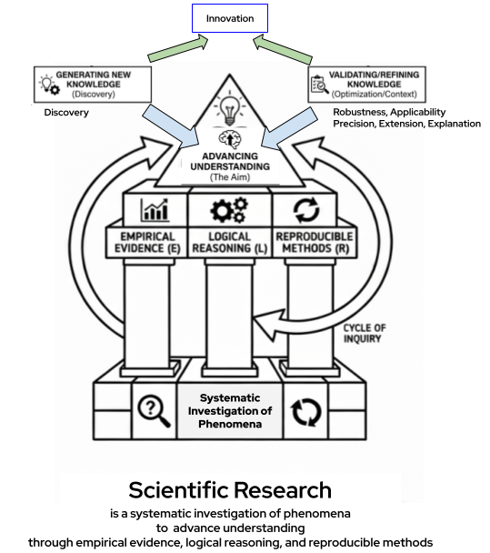
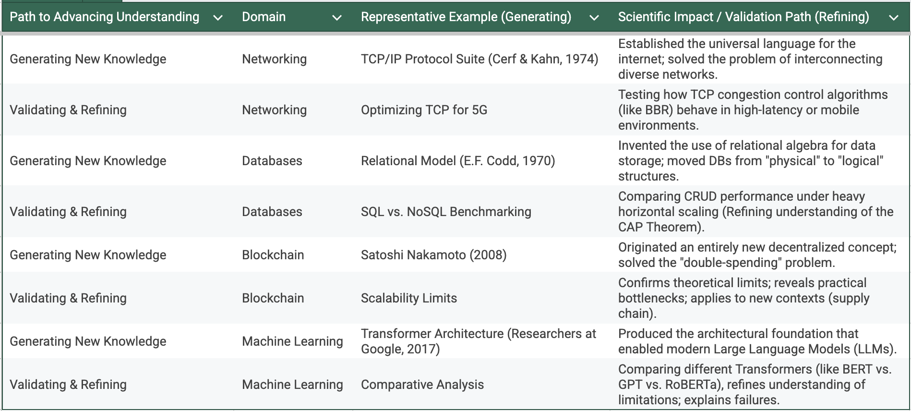

# Module 1: Foundations of Scientific Research in Information Technology

---
<!-- TOC -->
* [Module 1: Foundations of Scientific Research in Information Technology](#module-1-foundations-of-scientific-research-in-information-technology)
  * [Introduction to Scientific Research in Information Technology](#introduction-to-scientific-research-in-information-technology)
  * [Research Areas and Domains in Information Technology](#research-areas-and-domains-in-information-technology)
  * [Scientific Research vs. Software Development and Engineering](#scientific-research-vs-software-development-and-engineering)
  * [Scientific Research Lifecycle in Information Technology](#scientific-research-lifecycle-in-information-technology)
  * [Research Problems, Research Questions, and Hypotheses](#research-problems-research-questions-and-hypotheses)
    * [Research Problem (Problem Identification & Motivation)](#research-problem-problem-identification--motivation)
    * [Research Questions (RQs)](#research-questions-rqs)
    * [Hypotheses](#hypotheses)
  * [Research Types in Information Technology](#research-types-in-information-technology)
  * [Reproducibility, Replicability, and Transparency in Scientific Research](#reproducibility-replicability-and-transparency-in-scientific-research)
* [Case Study](#case-study)
  * [Setting up the development environment for Case Study 1](#setting-up-the-development-environment-for-case-study-1)
    * [Node.js & npm Installation](#nodejs--npm-installation)
  * [REST architectural principles](#rest-architectural-principles)
    * [What is a RESTful API?](#what-is-a-restful-api)
    * [Route definition in Express.js](#route-definition-in-expressjs)
    * [Implementation of a simple RESTful API](#implementation-of-a-simple-restful-api)
<!-- TOC -->

---

## Introduction to Scientific Research in Information Technology

Scientific research is a systematic and structured process of investigating phenomena in order to advance understanding 
through empirical evidence, logical reasoning, and reproducible methods.



Advancing understanding is achieved by generating new knowledge or by validating&refining existing knowledge.

**Research Samples and Examples of Advancing IT Knowledge**




Scientific research in IT specifically focuses on the evaluation, comparison, 
and improvement of software systems, architectures, algorithms, data-driven models, and IT services through controlled 
experiments and performance analysis.

Unlike routine development or engineering tasks, scientific research aims to produce generalizable, 
verifiable, and reproducible findings that contribute to the academic and professional IT community.

**Key Characteristics of Scientific Research**

1. **Systematic** – Follows a planned and organized procedure, not random investigation.
2. **Structured** – Steps are logically arranged from problem definition to conclusion.
3. **Empirical** – Based on observations, measurements, or experiments.
4. **Objective** – Minimizes personal bias; conclusions rely on evidence.
5. **Reproducible** – Others can repeat the study and verify the results.
6. **Logical** – Uses reasoning and proper analysis to connect evidence to conclusions.
7. **Innovative** – Aims to generate new knowledge or improve existing understanding.

> Generating new knowledge is the most direct form of innovation, but validating, refining, or explaining existing
theories is also innovative when it advances understanding, applies knowledge in new contexts,
or reveals previously unknown insights.

---

## Research Areas and Domains in Information Technology

Information Technology research spans multiple applied domains, including but not limited to:

* Computer Science Core: Algorithms, data structures, computational theory, programming languages, and compilers.

* Artificial Intelligence & Machine Learning: Developing systems that learn, reason, and act intelligently (e.g., neural networks, NLP, computer vision, robotics).

* Data Science & Big Data: Techniques for data mining, analytics, visualization, and management at massive scales.

* Computer Systems & Networks: Operating systems, distributed systems, cloud/edge computing, network architectures, and Internet technologies.

* Cybersecurity & Privacy: Cryptography, network security, software security, privacy-enhancing technologies, and digital forensics.

* Human-Computer Interaction (HCI) & UX: Studying and designing interfaces for effective and satisfying interaction between humans and digital systems.

* Software Engineering: Researching processes, methodologies, tools, and metrics for efficient, reliable, and maintainable software development and evolution.

* Information Systems: Studying the design, implementation, management, and impact of IT systems within organizational and social contexts.

Research in IT is typically **applied and experimental**, focusing on system behavior, performance, scalability, reliability, and usability.

---

## Scientific Research vs. Software Development and Engineering

Although scientific research and software development and engineering both involve building IT systems, they differ fundamentally in their goals, processes, and outcomes:

- **Software development and engineering** aim to design, implement, deploy, and maintain functional, reliable, and usable IT systems that satisfy specified technical and business requirements.
- **Scientific research** aims to evaluate, compare, explain, or improve techniques, systems, and algorithms through controlled experiments and performance analysis.

Key distinctions include:
- Scientific research is **driven by research questions and hypotheses**; software development and engineering are **driven by functional and non-functional requirements**.
- Scientific research emphasizes **experimental evaluation and analytical reasoning**; software development and engineering **emphasize implementation, integration, and delivery**.
- Scientific research **outputs include research papers, experimental datasets, and evaluation results**; software development and engineering **outputs include deployable systems and operational artifacts**.
- Scientific research **requires reproducibility and transparency**; software development and engineering prioritize maintainability, scalability, and usability.

In scientific research, software systems are typically **research tools or experimental instruments** used to conduct experiments and generate empirical evidence, rather than the final goal.

---

## Scientific Research Lifecycle in Information Technology

The scientific research lifecycle is a structured process used to produce reliable and valid scientific knowledge in a systematic way.
It breaks scientific research into distinct stages, each with specific objectives, methods, and deliverables.


**1. Problem Identification**

A **research problem** is a clearly stated issue, gap, or limitation in existing knowledge or
practice that requires systematic investigation. 

It is **identified through observations and motivation**, framed within a specific context and scope, and **formally
expressed as a problem statement**.


**Observations**  
Noticing phenomena, limitations, gaps, or inefficiencies in existing systems or practices.  
*Example:* “Response time of a RESTful service increases sharply as the number of concurrent users grows.”

**Motivation**  
Explaining why the identified problem matters from a technical, scientific, or practical perspective.  
*Example:* “High latency under load degrades user experience, limits scalability, and affects system reliability.”

**Context and Scope**  
Defining where the problem occurs and under what conditions, to avoid being too broad.  
*Example:* “The problem is examined in RESTful web services operating under high concurrency, focusing on backend 
database choice.”

**Problem Statement**  
A concise and clear description of the specific problem to be investigated.  
*Example:* “This study investigates how the choice of database backend (in-memory vs. PostgreSQL) affects the latency 
and throughput performance of a RESTful service under high concurrent load.”

**2. Literature Review**
- Systematic study of existing work (academic and professional)
- Understanding state-of-the-art methods, findings, and limitations
- Identifying theoretical frameworks and avoiding reinvention
- Synthesizing knowledge to precisely position your contribution

*Example:*

- Review existing studies on:
  - RESTful service performance evaluation
  - In-memory vs. disk-based databases
  - Benchmarking and load-testing methodologies
- Identify:
  - Common performance metrics (latency, throughput)
  - Typical experimental setups and tools
  - Limitations or conflicting findings in prior work
- Position the research by identifying what has **not** been sufficiently evaluated (e.g., controlled comparison under 
identical REST architecture).

>**Latency** – The time it takes for a request to travel from a client to the RESTful service and back; lower
latency means faster response.
>**Throughput** – The number of requests the service can handle per unit of time; higher throughput indicates
better capacity and efficiency.

**3. Research Questions &  Hypotheses**

**Research questions(RQs)** refine the research problem into specific, focused questions that guide the investigation.

*Example:*
* How does database choice affect response time in a RESTful service?
* How does throughput change when concurrent user load increases?

A **hypothesis** is a testable, evidence-based statement that predicts an expected outcome. In scientific research, 
hypotheses are formally represented as:

  * H₀ (Null Hypothesis): Assumes no effect, no difference, or no relationship between variables. It represents the 
default assumption to be tested.
  * H₁ (Alternative Hypothesis): Represents a specific expected effect or difference that the researcher aims to find 
evidence for.

In most research studies, there can be multiple hypotheses, each corresponding to a different research question or 
aspect of the problem. Each alternative hypothesis has a corresponding null hypothesis, forming a testable pair.

*Example:*
- **Hypotheses (paired):**
  - **H₀₁:** Database type has no effect on average response time.  
    **H₁₁:** An in-memory database exhibits lower latency than PostgreSQL under high load.
  - **H₀₂:** Database type has no effect on throughput.  
    **H₁₂:** An in-memory database achieves higher throughput than PostgreSQL.


**4. Methodology Design**
- Selecting appropriate research paradigm:
  - Empirical/Experimental
  - Theoretical
  - Simulation-based
  - Case Study 
  - Design Science
  - Mixed Methods
- Designing detailed procedures: variables, datasets, tools, metrics
- Planning for validity, reliability, and ethical considerations

*Example:*
- **Research Paradigm:** Empirical / Experimental research
- **Experimental Design:**
  - Independent variable: Database type (In-memory, PostgreSQL)
  - Dependent variables: Response time, throughput
  - Controlled variables: REST API logic, hardware, workload pattern
- **Tools & Metrics:**
  - Load-testing tool: Artillery
  - Metrics: Mean latency, percentiles, requests per second
- **Validity & Reliability:**
  - Same codebase and environment for both configurations
  - Repeated experiments to reduce randomness

A controlled benchmark-style experiment is planned.

**5. Implementation & Data Collection**
- Developing prototypes, algorithms, or experimental setups
- Conducting experiments, simulations, surveys, or observations
- Systematically gathering and documenting data
- Ensuring reproducibility through detailed logging

*Example:*

- Implement a simple RESTful API with interchangeable data layers.
- Deploy two configurations:
  - In-memory database
  - PostgreSQL database
- Generate traffic using Artillery with increasing concurrency levels.
- Collect logs and performance metrics systematically.
- Document configurations to ensure reproducibility.

Software acts as an **experimental testbed**, not the final product.


**6. Data Analysis & Interpretation**
- Applying appropriate statistical or qualitative analysis methods
- Interpreting results in context of research questions
- Drawing evidence-based conclusions
- Addressing limitations and alternative explanations

**Example:**

- **Quantitative Analysis**
  - Compute descriptive statistics: **mean, median, P95, P99 latency**, and **throughput (requests/sec)**
  - Analyze **utilization and latency–throughput graphs** to observe system behavior under increasing load
  - Apply **statistical significance testing (e.g., t-test)** to compare database configurations

- **Hypothesis Evaluation**
  - Statistical tests indicate a **significant difference** between configurations
  - **H₀ hypotheses are rejected**, providing evidence that database choice affects performance

> Hypotheses may be clarified before dissemination, but new or substantially revised hypotheses belong to the next research cycle.

Original H₁: In-memory DB always outperforms PostgreSQL
Refined H₁: In-memory DB outperforms PostgreSQL under low–moderate concurrency

- **Interpretation and Discussion**
  - **Performance trends:** Latency increases gradually at low load and sharply after a concurrency threshold,
    while throughput growth slows down
  - **Saturation points:** The system reaches saturation when throughput stops increasing and tail latencies (P95/P99) rise rapidly
  - **Alternative explanations:** Differences may result from database caching, connection pooling, or query optimization strategies.


Conclusion: The results show a statistically significant performance difference between database configurations, leading
to rejection of the null hypotheses and confirming that database choice affects RESTful service latency and throughput.

**7. Dissemination & Peer Review**
- Communicating findings through papers, theses, reports, presentations
- Submitting to peer-reviewed venues (conferences, journals)
- Responding to critique and revising work based on feedback
- Sharing artifacts (code, data) for reproducibility

The outcome is **generalizable, verifiable, and reproducible knowledge**

**8. Iteration & Future Research**
- Contemplating limitations and unanswered questions to guide future research
- Using feedback to refine research direction
- Identifying new problems emerging from findings
- Initiating next research cycle

*Example:*
- Extend the study by evaluating additional database systems (e.g., NoSQL or cloud-managed databases).
- Test the RESTful service under different workload patterns (read-heavy vs. write-heavy).
- Investigate performance in distributed or cloud-based deployment environments.
- Refine/add hypotheses based on observed saturation behavior and re-run experiments to validate robustness.

Observed behavior: Latency increases sharply after 300 concurrent users (saturation point).

Refined hypothesis:
“Beyond a concurrency threshold, PostgreSQL degrades more rapidly than the in-memory database.”
Re-run experiments: Test around and beyond the saturation point to see if this behavior consistently appears.

Observed result:
PostgreSQL performs better beyond a certain concurrency level.

New hypothesis (added):
“At high concurrency, PostgreSQL’s connection pooling and query optimization lead to better performance than an in-memory database.”
Re-run experiments: Test around and beyond a certain concurrency level to see if this behavior consistently appears.

> Hypotheses may be clarified before dissemination, but new or substantially revised hypotheses belong to the next research cycle.


## Research Problems, Research Questions, and Hypotheses

This subsection explains how a scientific investigation is formally defined before selecting a research type or methodology.  
It also highlights the **iterative nature** of problem formulation in scientific research.

---

### Research Problem (Problem Identification & Motivation)

A **research problem** is a clearly stated issue, gap, or limitation in existing knowledge or 
practice that requires systematic investigation.

- Often originates from **observations**, practical experience, or system behavior
- **Refined through literature review** to ensure relevance, originality, and scientific value
- May be updated after studying the state of the art
- Broad in scope but clearly motivated

*Example (RESTful Service Case Study):*  
Initial observation: RESTful services experience performance degradation under load.  
Refined research problem (after literature review):  
The performance impact of different database backends on RESTful services under high concurrency is not sufficiently 
quantified.

---

### Research Questions (RQs)

**Research questions** refine the research problem into specific, focused questions that guide the investigation.

- Clear, precise, and answerable
- Derived from the refined research problem
- Do not assume outcomes

*Examples:*
- How does database choice affect response time in a RESTful service?
- How does throughput change as concurrent user load increases?

---

### Hypotheses

A **hypothesis** is a testable, evidence-based statement that predicts an expected outcome. 
In scientific research, hypotheses are formally represented as:

- **H₀ (Null Hypothesis):** Assumes no effect, no difference, or no relationship between variables. It represents the 
default assumption to be tested.
- **H₁ (Alternative Hypothesis):** Represents a specific expected effect or difference that the researcher aims to 
find evidence for.

In most research studies, there can be **multiple hypotheses**, each corresponding to a different research question or 
aspect of the problem. Each alternative hypothesis has a corresponding null hypothesis, forming a testable pair.

---

**How Hypotheses Are Used**

- Statistical tests evaluate **H₀** using collected experimental data.
- If the evidence is strong enough (e.g., p-value < 0.05), **H₀ is rejected**, providing support for **H₁**.
- Scientific experiments do **not prove H₁ directly**; they test whether there is enough evidence to reject H₀.

> Supporting the null hypothesis is scientifically meaningful, as it provides evidence-based confirmation that an 
> assumed effect or difference does not occur under the tested conditions, contributing to reliable and reproducible knowledge.

> **Key Teaching Insight:** Each expected effect in a study should have its own H₀/H₁ pair to ensure clarity, 
> testability, and interpretability.

---

**Example (RESTful Service Case Study)**

- **H₀₁ / H₁₁ (Latency):**
  - H₀₁: Database type has no effect on average response time.
  - H₁₁: An in-memory database will exhibit lower average latency than PostgreSQL under high load.

- **H₀₂ / H₁₂ (Throughput):**
  - H₀₂: Database type has no effect on throughput.
  - H₁₂: Throughput will be higher for the in-memory database configuration.

- **H₀₃ / H₁₃ (Concurrency Effect):**
  - H₀₃: Concurrency level does not influence performance differences between databases.
  - H₁₃: Performance differences increase as concurrent load increases.

---

**Interpreting Unexpected Results**

If experimental results **do not support the expected alternative hypothesis**:

**Example: Assume that PostgreSQL shows lower latency than the in-memory database.**


**Step 1: Evaluate H₀₁**
- **H₀₁ (Null Hypothesis):** “Database type has no effect on average response time.”
- Use statistical tests (e.g., t-test) to determine if the difference in latency is statistically significant.

**Step 2: Compare with H₁₁**
- **H₁₁ (Alternative Hypothesis):** “In-memory database will exhibit lower latency than PostgreSQL under high load.”

**Step 3: Interpretation**
- If the data shows PostgreSQL has lower latency, the evidence does **not support H₁₁**.
- Depending on the statistical test:
  - H₀₁ is **not rejected** if the difference is not statistically significant.
  - If the difference is significant but in the **opposite direction**, H₀₁ is technically rejected, but H₁₁ is **not supported**.

**Step 4: Scientific Conclusion**
- H₁₁ is **rejected**, because the expected effect (in-memory faster than PostgreSQL) was not observed.
- Report results honestly:
  > “Contrary to expectations, PostgreSQL exhibited lower latency than the in-memory database under high load.”

**Step 5: Insights**
- The outcome is still scientifically valuable:
  - Reveals hidden performance factors (e.g., caching, connection handling, query optimization)
  - Can lead to **new hypotheses** or further investigation
  - Demonstrates that hypotheses can be wrong — yet the experiment still provides **validated insight**


> Hypothesis rejection does **not indicate failure**. It provides **validated evidence about the system’s behavior**, 
> reveals hidden factors, and may lead to new research questions.

---

**Relationship Between Research Problems, Research Questions, and Hypotheses**

- **Observation** triggers inquiry
- **Research problem** defines *what and why*
- **Research questions** define *what to ask*
- **Hypotheses** define *what is expected and tested*

**Key Insight:**
> Research problems are not fixed; they are often **refined through literature review**, reflecting the iterative 
> nature of scientific research in Information Technology.
> 
> Changes in the research problem require corresponding updates to research questions and hypotheses to maintain 
> scientific coherence(logical alignment and consistency between them) and methodological alignment.

---


## Research Types in Information Technology

Scientific research in IT can be classified along several dimensions:

1) Research Types Based on Purpose
- **Basic (Fundamental) Research:** 
  - Generates new theoretical knowledge without immediate application.
  - Less common in IT compared to applied research.
  - Example: Studying theoretical limits of network protocols.
- **Applied Research:** 
  - Solves practical, real-world IT problems.
  - Very common in Information Technology research.
  - Example: Improving performance of a RESTful service architecture.
- **Developmental Research:** 
  - Designs or improves systems, tools, or frameworks.
  - Often overlaps with applied research.
  - Example: Developing a new monitoring framework for distributed systems.

2) Research Types Based on Methodology
- **Experimental Research:** 
  - Involves controlled experiments to test hypotheses.
  - Manipulates independent variables and measures dependent variables.
  - Example: Measuring API response time under varying loads.
- **Empirical Research:** 
  - Based on observed and measured data.
  - Example: Evaluating multiple ML models using benchmark datasets.
- **Design Science Research:** 
  - Focuses on building and evaluating IT artifacts.
  - Combines construction and evaluation.
  - Example: Designing a new caching mechanism and evaluating its performance.
- **Non-Experimental Research:**
  - Observes systems without controlled manipulation.
  - Example: Analyzing real-world server logs to identify usage patterns.

3) Research Types Based on Data Characteristics
- **Quantitative Research:** 
  - Uses numerical data and statistical analysis.
  - Dominant in IT research.
  - Example: Accuracy, throughput, latency, etc. measurements.
- **Qualitative Research:** 
  - Uses non-numerical data such as user feedback and observations.
  - Less common but relevant in HCI and usability research.
  - Example: User interviews for interface usability evaluation.
- **Mixed-Methods Research:** 
  - Combines quantitative and qualitative approaches.
  - Measuring system performance and collecting user feedback.

4) Research Types Based on Research Strategy
- **Case Study Research:** 
  - In-depth analysis of a specific system or scenario.
  - Widely used in IT.
  - Example: Detailed evaluation of a microservice architecture.
- **Survey Research:** 
  - Data collection from a large population.
  - Often used for technology adoption studies.
  - Example: Survey on cloud adoption challenges.
- **Benchmarking Research:** 
  - Comparison using standard datasets or workloads.
  - Example: Comparing ML classifiers using the Iris dataset.
- **Comparative Research:** 
  - Evaluation of multiple approaches under similar conditions.
  - Example: Comparing relational vs noSQL databases.

---

## Reproducibility, Replicability, and Transparency in Scientific Research

- **Reproducibility (same data, same code):**  
  The ability to obtain the same results using the original data and analysis methods. This is a minimum standard in 
scientific research.
  Many IT-related fields, including machine learning and data science, face reproducibility challenges where published 
  results cannot be reliably reproduced.

- **Replicability (new data, same method):**  
  The ability of independent researchers to achieve consistent results by applying the same methodology to new data or 
in different contexts, strengthening the validity of findings.

- **Transparency Practices in Scientific Research:**
  - **Open Data:** Sharing de-identified datasets used in experiments.
  - **Open Source Code:** Publishing full source code and analysis scripts.
  - **Detailed Methodology:** Clearly documenting experimental design, parameters, and hardware/software environments.
  - **Open Access:** Making research outputs freely available.
  - **Artifact Evaluation:** Enabling reviewers to verify claims using submitted code and data.

Adhering to these principles increases the credibility, reliability, and scientific value of IT research.

---

# Case Study

## Setting up the development environment for Case Study 1

### Node.js & npm Installation

**Setting Up the Development Environment**


* Download Node.js from here (https://nodejs.org/en/download) and install it properly.

* Install WebStorm or set up Intellij for Node.js based development
  - IntelliJ IDEA -> Preferences -> Plugins -> Node.js (OSX, Linux)
  - IntelliJ IDEA -> File -> Settings -> Plugins -> Node.js (Windows)

* Initialize a new Node.js project
  - WebStorm/IntelliJ IDEA -> File -> New -> Project -> Empty Project (Give the project an appropriate name.)
  - Open the terminal in WebStorm/IntelliJ
  - npm init -y
  - Make a /src folder for the source code of the project

* Make a hello-world.js file and write the following code:
  - console.log('Hello world.');

* Run the app:
  - node hello-world.js

## REST architectural principles

### What is a RESTful API?

REST (Representational State Transfer) is an architectural style (or a set of principles) for designing networked applications.

RESTful refers to web services that adhere to the principles of REST (Representational State Transfer).

RESTful is an approach for building scalable, stateless web APIs that use standard HTTP methods and principles.


**Key Characteristics**

1. **HTTP Methods**: RESTful APIs use standard HTTP methods to perform operations on resources:

   | **HTTP Method** | **Usage** |
      |---------------|---------|
   | `GET`        | Retrieve resource (Read) |
   | `POST`       | Add new resource (Insert) |
   | `PUT`        | Update existing resource (Replace) |
   | `PATCH`      | Update a specific part of resource (Modify) |
   | `DELETE`     | Remove resource |

2. **Resource-Based**: RESTful APIs use resources, which are identified by URLs.
   A resource could be a user, a product, or a function to control a heating system.

3. **JSON or XML**: Data is typically exchanged in JSON or XML format, with JSON being more common due to its
   simplicity and ease of use.

4. **Stateless**: The server does not store any client context between requests.

**Example Endpoints**

- **GET /users**: Retrieve a list of users.
- **POST /users**: Add a new user.
- **GET /users/{id}**: Retrieve a specific user by ID.
- **PUT /users/{id}**: Replaces (or fully updates) the user representation.
- **DELETE /users/{id}**: Delete a specific user by ID.
- **GET /heating-system/state**: Retrieve the current status of the heating system.
- **PUT /heating-system/state {"power":"on", "temperature":"22"}** : Full state replacement
- **PATCH /heating-system/state {"power":"off"}**: Partially update

***In RESTful APIs, a URI (path) must identify a resource, while the HTTP method defines the action performed on that resource.***


### Route definition in Express.js

A **route** in Express.js defines an endpoint where clients send requests to interact with the service.

Each route consists of:

1. **An HTTP method** (GET, POST, etc.)
2. **A URL pattern** (e.g., `/api/customers/:id`)
3. **A callback function / route handler ** to handle the request

Example of a simple route in Express.js:

**Code Example**

```javascript
app.get("/api/customers", (req, res) => {
    res.json({ message: "List of customers" });
});
```


**HTTP Status Codes**
HTTP Status Codes are 3-digit numbers returned by web servers to indicate the status of a requested HTTP operation
(successful, failed, not found, etc.).

Here are some common status codes and their meanings:

| **Status Code**       | **Meaning**                          |
|------------------------|--------------------------------------|
| **200 OK**             | The request was successful.          |
| **201 Created**        | The resource was created successfully.|
| **400 Bad Request**    | The client sent an invalid request.  |
| **401 Unauthorized**   | Authentication is required.          |
| **403 Forbidden**      | Access to the resource is denied.    |
| **404 Not Found**      | The requested resource does not exist.|
| **500 Internal Server Error** | A server-side error occurred.     |

---

### Implementation of a simple RESTful API

**Code Example: /part1/server.js**

```javascript
// ───────────────────────────────────────────────────────────────
// Import Required Modules
// ───────────────────────────────────────────────────────────────
const express = require("express"); // Import the Express.js framework

// ───────────────────────────────────────────────────────────────
// Configuration & Constants
// ───────────────────────────────────────────────────────────────
const app = express(); // Initialize an Express application
const PORT = 3000; // Define the port number where the server will listen

// ───────────────────────────────────────────────────────────────
// Middleware: JSON Parser
// ───────────────────────────────────────────────────────────────
// Middleware to parse JSON request bodies
app.use(express.json());


// ───────────────────────────────────────────────────────────────
// In-memory database: JSON array for products
// ───────────────────────────────────────────────────────────────
let products = [
  { id: 1, name: "SSD", price: 999.99 },
  { id: 2, name: "RAM", price: 499.99 },
];

// ───────────────────────────────────────────────────────────────
// Define Routes
// ───────────────────────────────────────────────────────────────
// Routes are the connection points (end points - addresses) in a web service where clients send requests to interact with the service.
// GET all products
app.get("/api/products", (req, res) => {
  res.json(products); // Respond with the list of all products
});

// GET a single product by ID
app.get("/api/products/:id", (req, res) => {
  const product = products.find((p) => p.id === parseInt(req.params.id)); // Find the product by ID
  if (!product) return res.status(404).json({ error: "Product not found" }); // If not found, respond with 404
  res.json(product); // Respond with the found product
});

// POST - Add a new product
app.post("/api/products", (req, res) => {
  const { name, price } = req.body; // Extract name and price from the request body
  if (!name || !price) return res.status(400).json({ error: "Invalid input" }); // Validate input

  const newProduct = { id: products.length + 1, name, price }; // Add a new product with a unique ID
  products.push(newProduct); // Add the new product to the list
  res.status(201).json(newProduct); // Respond with the added product
});


// PUT - Replace a Product Record (full replacement)
app.put("/api/products/:id", (req, res) => {
  // 1. Destructure and extract all fields from the request body.
  // Assuming 'name', 'price' are the mutable fields.
  const { name, price } = req.body;

  // 2. Validate the Request Body (Required for PUT)
  // Check if all required fields are present.
  // Note: Unlike the original code, we do NOT use '|| product.name'
  // because PUT must overwrite all fields, or fail.
  if (!name || price == null ) {
    return res.status(400).json({
      error: "PUT /products requires ALL mutable fields (name, price) for full replacement."
    });
  }

  // 3. Find the Product
  const product = products.find((p) => p.id === parseInt(req.params.id));
  if (!product) {
    return res.status(404).json({ error: "Product not found" });
  }

  // 4. Update/Replace: Directly assign ALL new values.
  product.name = name;
  product.price = price;

  // 5. Respond with the fully updated product
  res.json(product);
});

// PATCH - Modify a product (partial or full replacement)
app.patch("/api/products/:id", (req, res) => {
  const product = products.find((p) => p.id === parseInt(req.params.id)); // Find the product by ID
  if (!product) return res.status(404).json({ error: "Product not found" }); // If not found, respond with 404

  const { name, price } = req.body; // Extract name and price from the request body
  product.name = name || product.name; // Update the product name if provided
  product.price = price || product.price; // Update the product price if provided
  res.json(product); // Respond with the updated product
});

// DELETE - Remove a product
app.delete("/api/products/:id", (req, res) => {
  const productIdToDelete = parseInt(req.params.id);

  // 1. Store the initial count of products
  const initialLength = products.length;

  // 2. Filter the array, creating a new array without the specified product ID
  products = products.filter((p) => p.id !== productIdToDelete);

  // 3. Store the final count of products
  const finalLength = products.length;

  if (finalLength < initialLength) {
    // The product was found and successfully deleted (the array length decreased).

    // REST Best Practice: 204 No Content for a successful DELETE with no response body.
    res.status(204).end();
  } else {
    // The product was NOT found (the array length remained the same).

    // REST Best Practice: 404 Not Found indicates the resource doesn't exist.
    res.status(404).json({
      error: `Product with ID ${productIdToDelete} not found.`
    });
  }
});

// ───────────────────────────────────────────────────────────────
// Start Express HTTP Server
// ───────────────────────────────────────────────────────────────
app.listen(PORT, () => {
  console.log(`Server running on http://localhost:${PORT}`);
});

```

**Endpoints (Routes) of the developed API**

        GET http://localhost:3000/api/products

        GET http://localhost:3000/api/products/1

        POST http://localhost:3000/api/products
        Content-Type: application/json
        {
        "name": "HDD",
        "price": 299.99
        }

        PUT http://localhost:3000/api/products/2
        Content-Type: application/json
        {
        "name": "SSD",
        "price": 550.00
        }

        PATCH http://localhost:3000/api/products/2
        Content-Type: application/json
        {
        "price": 550.00
        }
    
        DELETE http://localhost:3000/api/products/1


**Testing REST api using HTTP Client**


**Code Example: /part1/restful-api-test.http**

```http request
###Retrieve all products
GET http://localhost:3000/api/products


### Find product by id
# curl -X GET http://localhost:3000/api/products
GET http://localhost:3000/api/products/2

###
POST http://localhost:3000/api/products
Content-Type: application/json

{"name": "SSD", "price": 500}

###
PUT http://localhost:3000/api/products/1
Content-Type: application/json

{"name": "Updated SSD", "price": 1099.99}


###
PATCH http://localhost:3000/api/products/1
Content-Type: application/json

{"price": 200}


###
# curl -X DELETE http://localhost:3000/api/products/1
DELETE http://localhost:3000/api/products/1
```
