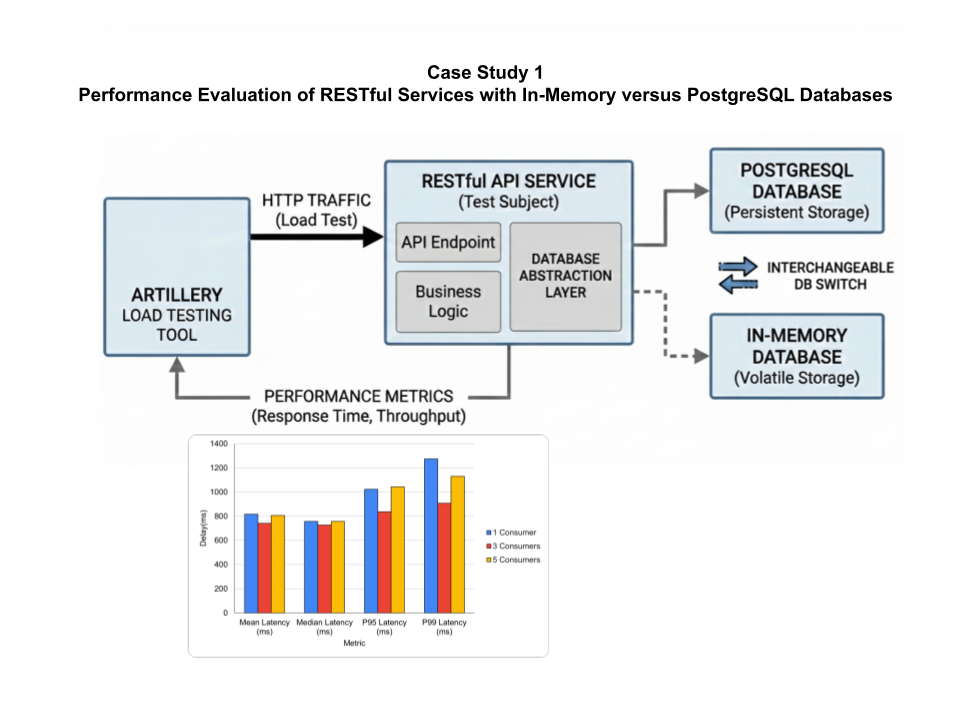
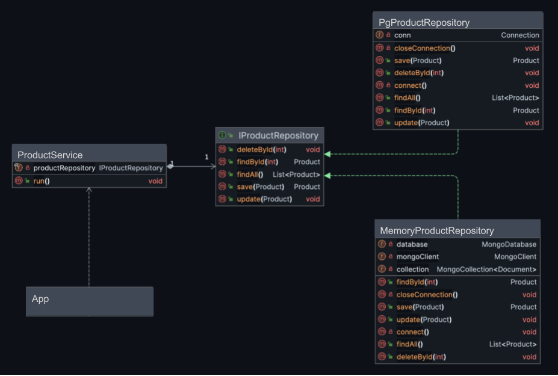

# Case Study 1




## Using a Programming Language to Interact With a Database

Modern applications often need to store, retrieve, and manipulate data dynamically.
To perform these database operations from within an application, database drivers are essential.
These drivers act as a bridge between the programming language and the database management system (DBMS).

### Database Drivers – Core Functions
Database drivers typically provide the following core capabilities:
- **Establishing a connection** to the database.
- **Executing queries** (e.g., `SELECT`, `INSERT`, `UPDATE`, `DELETE`).
- **Retrieving results** and processing query outputs.
- **Managing transactions** to ensure data consistency.
- **Closing the connection** after operations are completed.


### Database Operations with Java and PostgreSQL

Java applications can seamlessly interact with PostgreSQL databases using **JDBC** (Java Database Connectivity).  
JDBC is a **standard API** that defines a set of interfaces and classes for connecting to relational databases,
sending SQL statements, and processing results.

It provides:
- **Connection management**
- **Statement execution**
- **Result retrieval**
- **Error handling and transaction control**

The **PostgreSQL JDBC driver** implements this API and allows Java programs to work directly with PostgreSQL databases.

You can download the PostgreSQL JDBC driver from:  
[https://jdbc.postgresql.org/download/](https://jdbc.postgresql.org/download/)


#### Example Workflow (Conceptual)
1. **Load the driver**(library ) in the project environment so that the Node.js application can
   communicate with the database.
2. **Establish a connection** to the PostgreSQL database using a connection string (URL(socket address), username, and password).
3. **Define and execute SQL statements**.
4. **Process the results** returned by the query.
5. **Close** the statement and connection to free resources.


# Repository Pattern

***The Repository Pattern abstracts the logic of data access and storage from the business logic of an application.
It provides a clean separation between the domain layer and the data access layer.
Repositories act as mediators between the business logic and the data source (e.g., database, API, or file).
This abstraction improves maintainability, testability, and supports dependency inversion.***




**Code Example**

```sql
CREATE DATABASE ecommercedb;
```

```sql
CREATE TABLE products (
    id SERIAL PRIMARY KEY,
    name VARCHAR(100) NOT NULL,
    price DOUBLE PRECISION CHECK (price >= 0)
);
```


