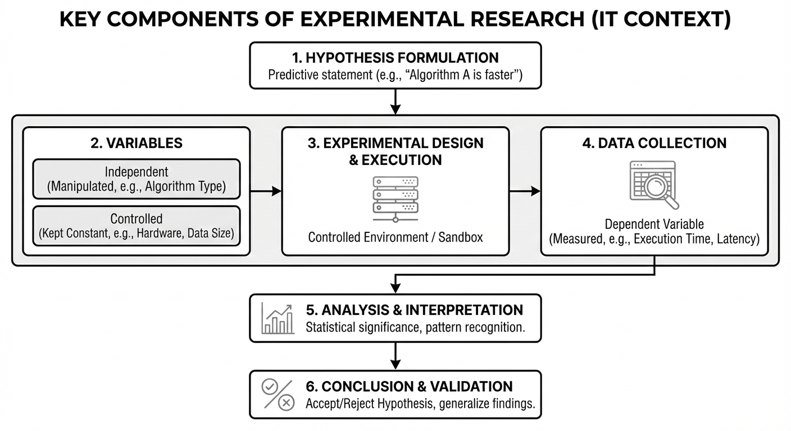

# Module 2: Experimental Research in Information Technology

<!-- TOC -->
* [Module 2: Experimental Research in Information Technology, Scientific Publications](#module-2-experimental-research-in-information-technology-scientific-publications)
  * [Experimental Research in Information Technology](#experimental-research-in-information-technology)
    * [Key Components of Experimental Research](#key-components-of-experimental-research)
    * [Types of Experimental Research in Information Technology](#types-of-experimental-research-in-information-technology)
  * [Some of the Performance Metrics for ICT Systems](#some-of-the-performance-metrics-for-ict-systems)
    * [1. Latency Metrics](#1-latency-metrics)
    * [2. Throughput Metrics](#2-throughput-metrics)
    * [3. Utilisation Metrics](#3-utilisation-metrics)
    * [4. Error and Reliability Metrics](#4-error-and-reliability-metrics)
    * [5. Accuracy Metrics (Data and ML Systems)](#5-accuracy-metrics-data-and-ml-systems)
    * [Final Summary](#final-summary)
  * [Case Study 1: Database Backend Performance in a RESTful Service](#case-study-1-database-backend-performance-in-a-restful-service)
    * [1. Hypothesis / Research Question (RQ)](#1-hypothesis--research-question-rq)
    * [2. Variables](#2-variables)
    * [3. Experimental Design](#3-experimental-design)
    * [4. Measurement and Instruments](#4-measurement-and-instruments)
      * [Benchmarking Procedure:](#benchmarking-procedure)
    * [5. Data Analysis and Conclusion](#5-data-analysis-and-conclusion)
    * [Summary Alignment](#summary-alignment)
<!-- TOC -->

## Experimental Research in Information Technology

Experimental research in Information Technology involves conducting controlled experiments on systems, algorithms, or
configurations to observe and measure their behavior. These experiments are designed to test hypotheses by
manipulating independent variables and measuring the resulting effects on dependent variables.

### Key Components of Experimental Research

- **Hypothesis / Research Question (RQ)**  
  A clear, testable statement or question that guides the experiment.  

  - **Example Research Questions:**
    - "Does a microservices architecture improve fault isolation compared to a monolith?"
    - "Will implementing Redis caching reduce API response time by 30% under peak load?"
    - "Can a convolutional neural network achieve >95% accuracy on the MNIST dataset?"

  - **Example Hypotheses:**
    - "H₁: A RESTful API using an in-memory database will have lower response latency than one using PostgreSQL under high load."
    - "H₁: Support Vector Machines may achieve higher classification accuracy than logistic regression on the Iris dataset
      because SVMs can model more complex decision boundaries."
    - "H₁: REST APIs with connection pooling will have 25% lower latency than those without under 1000 concurrent users."
    - "H₀: There is no difference in classification accuracy between Random Forest and Gradient Boosting on the Iris dataset."
    

- **Variables**
   - **Independent variables (***X***)-"The Cause":** Factors deliberately manipulated by the researcher.  
     *Example:* Algorithm type, workload size, UI layout.
   - **Dependent variables(***Y***)-"The Effect"":** Outcomes that are measured.  
     *Example:* Latency, accuracy, throughput, user task completion time.
   - **Controlled variables (constants):**
     - **Infrastructure:** CPU cores, memory, storage type (SSD vs HDD)
     - **Software stack:** OS version, runtime environment (Java 17, Python 3.9)
     - **Dataset characteristics:** Size, distribution, preprocessing steps
     - **Test conditions:** Warm-up period, measurement duration, think time
     - **Network:** Bandwidth, latency, packet loss simulation

- **Experimental Design** is the structured plan that defines **how an experiment is conducted**, ensuring that results 
are valid, fair, and reproducible. It specifies *what is being tested*, *what is being compared*, and *under what 
conditions*.

    - **Subjects** are the **entities on which the experiment is performed**. In IT research, subjects are usually 
  *not people*, but technical artifacts. Subjects define the **context and scope** of the experiment.

      *Examples:*
        - Datasets (e.g., Iris dataset, transaction logs)
        - System configurations (e.g., single-node vs distributed system)
        - Network traces or traffic patterns
        - Human participants (in usability or HCI studies)

    - **Treatments** are the **different conditions or alternatives applied to the subjects**. Each treatment represents
  a specific choice being evaluated. Treatments represent the **independent variable values** whose effects are being 
  measured.

      *Examples:*
        - Algorithm A vs Algorithm B
        - In-memory database vs PostgreSQL
        - REST API with caching vs without caching
        - UI Design A vs UI Design B

    - **Control Groups or Baselines** is a **reference setup** against which treatments are compared. It represents the 
  *standard*, *existing*, or *simplest* configuration. Baselines ensure **fair comparison** by isolating the impact of 
  treatments and preventing misleading conclusions.

      *Examples:*
          - Existing production system
          - Default algorithm implementation
          - System without optimization or enhancement
          - Standard security protocol

      *Example:*  
      When evaluating two security protocols, both are tested using the **same dataset, hardware, and network 
conditions**, with one serving as the baseline for comparison.

      

- **Measurement and Instruments**  
  Tools, frameworks, and metrics used to collect data.  
  *Examples:*
   - Latency,  throughput, utilization
   - Accuracy, precision, recall, F1-score
   - User error rate, task completion time
   - Number of detected security vulnerabilities

- **Data Analysis & Conclusion**  
  Interpretation of collected data to identify patterns, differences, and significance, leading to acceptance or
  rejection of hypotheses and validated insights.  
  *Examples:*
   - Descriptive statistics and visualizations (Mean, Median, Min/Max, Standard deviation, Percentiles) to summarize 
  performance metrics and trends.
   - Statistical tests (e.g., Mann-Whitney U, t-test...) to determine whether observed differences are significant.
   - Qualitative analysis for user feedback (Interviews, Open-ended survey responses, Observation notes) to interpret 
  usability or behavior.
   - Drawing conclusions and validating results by confirming whether hypotheses are supported and findings are 
  reproducible.
      - If the hypothesis is **supported**, the result becomes a **validated insight** — reliable knowledge confirmed 
     by data.
      - If the hypothesis is **not supported**, the finding still provides evidence, helping refine future research.

---

### Types of Experimental Research in Information Technology

- **Controlled Experiments (Benchmarks)**  
  Experiments conducted in a controlled laboratory environment to compare systems or algorithms.  
  *Example:* Benchmarking database performance under identical workloads.

- **Simulation and Modeling**  
  Using computational models to study complex or large-scale systems.  
  *Example:* Simulating network traffic using a network simulator to evaluate routing protocols.

- **Case Study–Based Experiments**  
  In-depth experimental investigation of a system or method in a real-world context.  
  *Example:* Evaluating the performance and scalability of a RESTful API by deploying it in a real organizational environment and measuring response time and throughput under real workloads.

- **Human-Centered Experiments (Common in HCI)**  
  Experiments involving human participants to evaluate usability, interaction, or user experience.  
  *Example:* A/B testing two user interface designs to measure task completion time and error rates.
  Two versions of a web form are shown to different user groups. Version A uses a single-page form, while Version B uses a multi-step form. Completion time and error rates are compared to determine which design performs better.

---

## Some of the Performance Metrics for ICT Systems

This section summarizes commonly used performance metrics for ICT systems.

In ICT (Information and Communication Technology) systems, performance is measured by more than just speed. To get a 
complete picture, you need to look at how resources are consumed, how reliable the data is, and how the system 
behaves under pressure.

Here is a summary of the key performance metrics, examples, and best practices.

---

### 1. Latency Metrics

Time taken to complete a single operation. Latency is the "speed" of your system. It measures the delay introduced 
by processing and network travel.

| Examples | Usage Example | Best Practices |
|--------|---------------|----------------|
| Average latency | Rough performance overview | Do not rely on averages alone |
| p50 (median) | Typical user experience | Use percentiles for analysis |
| p95, p99 | Tail latency and worst-case delays | Define SLOs (e.g., p95 < 200 ms) |

The Percentile Strategy ($p50, p95, p99$):
* Average latency: Rough performance overview. The average (mean) latency is often unreliable for performance analysis.
  * Some users may experience long delays while average indicates “acceptable performance".

* $p50$ (Median): It's the "average" experience. 50% of your users are faster than this, and 50% are slower.
  
* $p95$: The "Tail Latency." 95% of requests are faster than this. 
It’s the industry standard for judging if an app feels "snappy/good" for almost everyone.
It is the gold standard for Service Level Objectives (SLOs)-internal performance targets.

* $p99$: The "Worst Case." 99% of requests are faster than this. If this is high, 1 out of every 100 users is having a 
terrible experience such as Garbage Collection (GC) pauses or heavy database re-indexing (db locking).

**Recommended Latency SLOs (Typical Web Services)**

| Metric | Good | Acceptable | Poor |
|------|------|------------|------|
| **p50 (median)** | ≤ 100 ms | 100–200 ms | > 200 ms |
| **p95** | ≤ 200 ms | 200–500 ms | > 500 ms |
| **p99** | ≤ 500 ms | 500–1000 ms | > 1 s |

* Best Practice: Monitor the spread between $p50$ and $p99$. If the gap grows during a load test, it indicates the system is becoming unstable even if the "average" looks okay.

---

### 2. Throughput Metrics

Rate of successful work completion per time unit.

| Examples | Usage Example | Best Practices |
|--------|---------------|----------------|
| Requests per second (req/sec) | Measure the success and capacity of a web service or REST API | Measure sustained throughput; correlate with latency and errors |
| Transactions per second (TPS) | Evaluate database or financial transaction systems | Avoid relying on short bursts |
| Messages per second | Assess message brokers and streaming systems | Test under realistic workloads |
| Mbps | Network data transfer rate |  |

**For Case Study1:**

* Number of responses completed per unit time. 
* Throughput is the actual, measured rate at which data is successfully transferred over a network path from source to
destination in a given time frame.

>In an ideal world: Request throughput ≈ Response throughput (all requests succeed)
>In reality: As load increases, response throughput may plateau or drop while request throughput continues to increase

Artillery latency percentiles are computed only over completed responses; under overload, requests may fail before 
completion, causing failure rates to rise while p95/p99 remain deceptively stable.

During the test, as the request rate increased beyond ~724 req/sec, the number of successful responses began to decline 
while failures continued to rise. This indicates the system reached and exceeded its saturation point, where it can no 
longer process all incoming requests efficiently.

---

### 3. Utilisation Metrics

Percentage of resource capacity being used.

| Examples | Usage Example | Best Practices |
|--------|---------------|----------------|
| CPU utilisation (%) | Detect CPU bottlenecks in application servers | Keep sustained usage below ~80% |
| Memory usage (GB or %) | Identify memory leaks or insufficient RAM | Avoid swapping |
| Disk I/O utilisation | Evaluate storage performance | Monitor queue length |
| Network bandwidth usage | Detect network saturation | Leave headroom |

---

### 4. Error and Reliability Metrics

Error rate is percentage of operations that fail.

| Examples | Usage Example | Best Practices |
|--------|---------------|----------------|
| Error rate (%) | Assess reliability of a web service | Track trends over time |
| HTTP 5xx errors | Identify server-side failures | Investigate persistent errors |
| Availability (%) | Measure uptime of services | Target ≥ 99.9% where required |

---

### 5. Accuracy Metrics (Data and ML Systems)

Correctness of system outputs.

| Examples | Usage Example | Best Practices |
|--------|---------------|----------------|
| Accuracy | Evaluate classification systems | Avoid accuracy alone for imbalanced data |
| Precision | Measure correctness of positive predictions | Use with recall |
| Recall | Measure ability to detect positives | Balance with precision |
| F1-score | Overall model quality | Choose metric based on risk |

### Final Summary

- **Throughput** → Capacity and success rate (e.g., req/sec for web services)
- **Latency** → User-perceived responsiveness
- **Utilisation** → Resource efficiency
- **Accuracy** → Correctness of results
- **Reliability** → Stability and availability

A complete performance evaluation must combine multiple metrics rather than relying on a single one.

## Case Study 1: Database Backend Performance in a RESTful Service
*(In-Memory Database vs PostgreSQL)*

This case study examines how the choice of database backend affects the performance of a RESTful service under load.
It is aligned below with the **Key Components of Experimental Research** and **Experimental Design**.

---

### 1. Hypothesis / Research Question (RQ)

- **RQ:**  
  Does using an in-memory database result in lower latency and higher throughput for a RESTful service compared to PostgreSQL under the same workload?

- **Hypothesis:**  
  **H1:**A RESTful service backed by an in-memory database will exhibit **lower $p95$ latency** and **higher throughput** than the same service backed by PostgreSQL under high load.
  **H₀:** "There is no statistically significant difference in performance between in-memory database and PostgreSQL backends."
---

### 2. Variables

- **Primary Independent Variable (What we manipulate):**
    - Database type (In-memory database vs PostgreSQL)
- **Secondary Independent Variable(Workload):**
  - Arrival Rate of requests ($req/sec$).

- **Dependent Variables(What we measure):**
    1. **Latency (response time):**
       - Average response time (ms)
       - p95 response time (95th percentile)
       - p99 response time (99th percentile)
       - Maximum response time
    2. **Throughput:**
        - Requests per second (RPS)
        - Successful transactions per second
        - Error rate (%) - failed requests
    3. **Resource Utilization:**
       - CPU usage percentage
       - Memory consumption (RSS)
       - Disk I/O operations per second (for PostgreSQL)
       - Network bandwidth usage

- **Controlled Variables(What we keep constant):**
  1. Infrastructure Constants:
     - **Hardware:** Same VM/container specs (CPU, RAM, storage type)
     - **Network:** Same bandwidth, latency simulation
     - **OS & Runtime:** Same OS version, same Node.js
  2. Software Constants:
     - **App&Framework:** Same App & Frameworks/Libraries (Express.js, Flask, etc.)
     - **Benchmark Tool:** Same tool with same configuration
     - **Test Duration:** Same measurement period
     - **Warm-up Period:** Same warm-up time before measurement 
  3. Data Constants:
     - **Dataset Schema:** Same table structure
     - **Query Complexity:** Same SQL/NoSQL operations
     - **Connection Pool Size:** Same number of connections
     - **Load Profile/Script:** (ensuring the same test is run for both)

---

### 3. Experimental Design

- **Subjects:**
    - The RESTful service instances
    - Database systems (In-memory database and PostgreSQL)
    - Benchmark workload generated by the load-testing tool

- **Treatments:**
    - Treatment A: RESTful service using an in-memory database
    - Treatment B: RESTful service using PostgreSQL

- **Control Group / Baseline:**
    - In this comparative study, PostgreSQL serves as the Baseline (Industry Standard). The In-memory database is the 
  experimental treatment being tested for improvement against that standard.

---

### 4. Measurement and Instruments

- **Instruments:**
    - Load-testing / benchmarking tool (e.g., Artillery)
    - Monitoring tools for resource usage (CPU, memory)

- **Metrics Collected:**
    - Latency percentiles (p50, p95, p99)
    - Throughput (requests per second)
    - Error rate (failed requests)

#### Benchmarking Procedure:

**Phase 1: Environment Setup**
1. Deploy identical infrastructure for both treatments
2. Load identical dataset into both databases
3. Configure monitoring (Prometheus + Grafana)

**Phase 2: Warm-up (Eliminate cold-start effects)**
1. Run moderate load (50% of target) for 5 minutes
2. Verify system stability

**Phase 3: Measurement Runs**
For each concurrency level [10, 50, 100, 200]:
1. Start metrics collection
2. Apply load for 10 minutes
3. Record metrics every 10 seconds
4. Cool down for 2 minutes
5. Repeat 3 times per treatment (total: 12 runs per treatment)

**Phase 4: Cleanup & Data Collection**
1. Stop all services
2. Export metrics to CSV/JSON
3. Archive logs for reproducibility

---

### 5. Data Analysis and Conclusion

- **Analysis:**
  Analysis Method: * Visualization: Comparing "Knee of the Curve" graphs for both
    - Compare latency percentiles between the two treatments
    - Analyze throughput trends as load increases
    - Identify saturation points and performance degradation

- **Conclusion:**
    - Determine whether the in-memory database provides measurable performance benefits
    - Validate or reject the hypothesis based on empirical results
    - Discuss trade-offs such as performance gains versus persistence and reliability
      If the in-memory service maintains a flat latency curve while PostgreSQL's latency spikes at 500 req/sec, the hypothesis is Supported.

This leads to a Validated Insight: "In-memory databases are superior for high-throughput, low-latency requirements 
where data persistence is not the primary concern."

---

### Summary Alignment

| Experimental Component | Case Study Mapping                           |
|-----------------------|----------------------------------------------|
| Hypothesis | In-memory DB improves latency and throughput |
| Independent Variable | Database backend type, workload              |
| Dependent Variables | Latency, throughput                          |
| Subjects | REST service and database systems            |
| Treatments | In-memory DB vs PostgreSQL                   |
| Baseline | PostgreSQL-backed service                    |
| Instruments | Load-testing and monitoring tools            |
| Outcome | Evidence-based performance comparison        |
