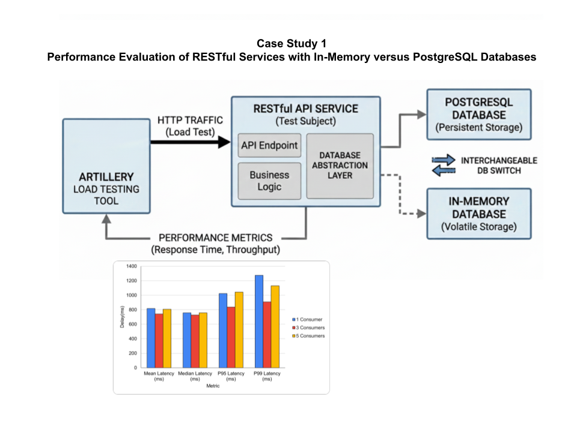
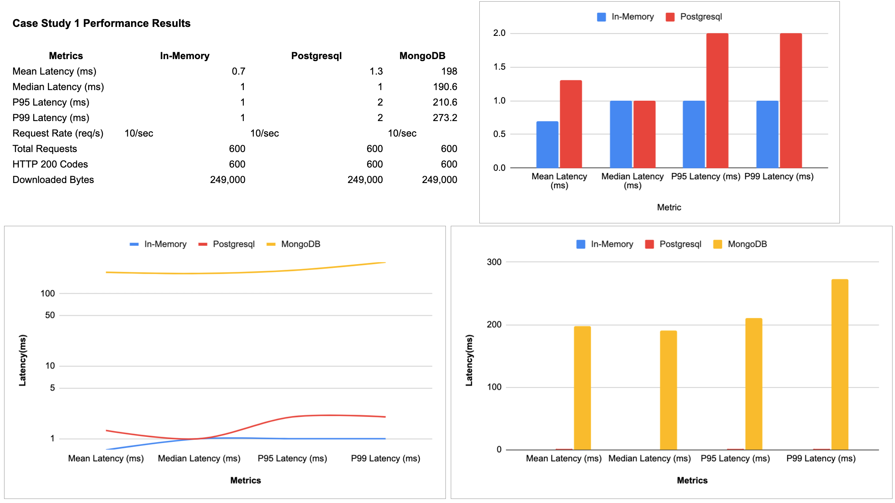

# Case Study 1: Performance Evaluation of RESTful Service with Different Database Backends


<!-- TOC -->
* [Case Study 1: Performance Evaluation of RESTful Service with Different Database Backends](#case-study-1-performance-evaluation-of-restful-service-with-different-database-backends)
  * [1. Introduction](#1-introduction)
  * [2. Using a Programming Language to Interact With a Database](#2-using-a-programming-language-to-interact-with-a-database)
    * [Database Drivers – Core Functions](#database-drivers--core-functions)
      * [Example Workflow (Conceptual)](#example-workflow-conceptual)
  * [3. Repository Pattern](#3-repository-pattern)
  * [4. RESTful Service](#4-restful-service)
  * [5. MongoDB Integration](#5-mongodb-integration)
  * [6. Load Testing Using Artillery](#6-load-testing-using-artillery)
    * [Fundamentals of Load and Stress Testing](#fundamentals-of-load-and-stress-testing)
    * [Writing First Test](#writing-first-test)
    * [Performance Metrics](#performance-metrics)
      * [Throughput](#throughput)
    * [Generating Test Report](#generating-test-report)
      * [Load Test Report Details](#load-test-report-details)
    * [Comparative Analysis of Test Results On The Cloud Service](#comparative-analysis-of-test-results-on-the-cloud-service)
    * [Send Test Results into a JSON file](#send-test-results-into-a-json-file)
    * [Monitoring Resource Utilisation During Tests](#monitoring-resource-utilisation-during-tests)
  * [Visualisation of Performance Results](#visualisation-of-performance-results)
<!-- TOC -->


## 1. Introduction

This case study investigates how the choice of database backend—an in-memory database versus PostgreSQL—affects the 
performance of a RESTful service. The service is subjected to controlled load using a benchmarking tool, and key 
performance metrics such as latency and throughput are measured and analyzed. The study demonstrates how 
experimental design, hypothesis testing, and performance evaluation are applied to real-world IT systems.

[Experimental Design of Case Study 1](../README.md#case-study-1-database-backend-performance-in-a-restful-service)





## 2. Using a Programming Language to Interact With a Database

Modern applications often need to store, retrieve, and manipulate data dynamically.
To perform these database operations from within an application, database drivers are essential.
These drivers act as a bridge between the programming language and the database management system (DBMS).

### Database Drivers – Core Functions
Database drivers typically provide the following core capabilities:
- **Establishing a connection** to the database.
- **Executing queries** (e.g., `SELECT`, `INSERT`, `UPDATE`, `DELETE`).
- **Retrieving results** and processing query outputs.
- **Managing transactions** to ensure data consistency.
- **Closing the connection** after operations are completed.


#### Example Workflow (Conceptual)
1. **Load the driver**(library) in the project environment so that the Node.js application can
   communicate with the database.
2. **Establish a connection** to the PostgreSQL database using a connection string (URL(socket address), username, and password).
3. **Define and execute SQL statements**.
4. **Process the results** returned by the query.
5. **Close** the statement and connection to free resources.


## 3. Repository Pattern

***The Repository Pattern abstracts the logic of data access and storage from the business logic of an application.
It provides a clean separation between the domain layer and the data access layer.
Repositories act as mediators between the business logic and the data source (e.g., database, API, or file).
This abstraction improves maintainability, testability, and supports dependency inversion.***


**Code Example**

```sql
CREATE DATABASE sr_case_study_1_db;
```

```sql
CREATE TABLE products (
    id SERIAL PRIMARY KEY,
    name VARCHAR(100) NOT NULL,
    price DOUBLE PRECISION CHECK (price >= 0)
);
```


## 4. RESTful Service

>[app.js](./app.js)

```http request
###Retrieve all products
GET http://localhost:3000/api/products


### Find product by id
# curl -X GET http://localhost:3000/api/products
GET http://localhost:3000/api/products/8

###
POST http://localhost:3000/api/products
Content-Type: application/json

{"name": "SSD", "price": 500}

###
PUT http://localhost:3000/api/products/1
Content-Type: application/json

{"name": "Updated SSD", "price": 1099.99}


###
PATCH http://localhost:3000/api/products/1
Content-Type: application/json

{"price": 200}


###
# curl -X DELETE http://localhost:3000/api/products/1
DELETE http://localhost:3000/api/products/1

```

## 5. MongoDB Integration

https://github.com/cllckn/database-management-systems/tree/main/module5

> [MongoDB Repository](../case-study-1-assignment1/repositories/MongoDBProductRepository.js)

## 6. Load Testing Using Artillery

### Fundamentals of Load and Stress Testing


**Load Testing:** Simulating realistic user traffic on your application to understand its behavior under expected peak loads.
This helps identify performance bottlenecks, ensure scalability, and maintain a good user experience.

**Stress Testing:** Pushing your system beyond its normal operating conditions to identify breaking points, understand
its resilience, and determine its maximum capacity. This helps uncover stability issues and potential failure scenarios.


**Artillery** is a powerful and versatile open-source load testing and stress testing tool written in Node.js. It's designed to be
easy to use for developers while providing the necessary features for comprehensive performance evaluation of web applications,
APIs, web sockets, and other backend services.

**The Benefits of Load and Stress Testing:**

* Performance Bottlenecks: Identify system limitations (CPU, memory, disk) that slow down performance.
* Scalability: Determine how many users/transactions the system can handle.
* Stability: Ensure the system remains stable under normal and peak loads.
* Error Detection: Uncover errors that only appear under heavy load (e.g., race conditions-two transactions updating the same row without isolation.).
* Resource Leaks: Help detect memory leaks, which can degrade performance over time.
* System Limits: Determine the system's breaking point and failure behavior.
* Database Performance: Evaluate database query performance and identify bottlenecks.
* Network Capacity: Assess network bandwidth and latency under load.
* Infrastructure Optimization: Provide data for hardware and software capacity planning.
* User Experience: Ensure acceptable response times and a smooth user experience under load.

### Writing First Test

* Install artillery
```shell
npm install --save-dev artillery 
```

* Write a sample load test script (/tests/load-test-v1.yml)

```yaml
config:
  target: 'http://localhost:3000' # Replace with your application's URL if different
  phases:
    - duration: 60 # Run the test for 60 seconds
      arrivalRate: 20 # Simulate 20 new virtual users arriving per second
  defaults:
    headers:
      Content-Type: 'application/json' # Assuming your API uses JSON

scenarios:
  - name: Load Test - homepage
    flow:
      - get:
          url: '/' # Test the homepage

```

* Go to /tests/ and run the load test
```shell
artillery run load-test-v1.yml
```


### Performance Metrics

#### Throughput

http.requests	The Offered Load (Rate of attempt).
http.responses	The Actual Throughput (Rate of success).
http.codes.200	The "Good" Throughput (Successful data transfer).


### Generating Test Report

- register to the Artillery Cloud (https://app.artillery.io)
```shell
artillery run load-test-v1.yml --record --key a9_yomj66tcygft1lryqig2ge...
```
    Run URL: https://app.artillery.io/oxf4vxtdmcfsd/load-tests/t5wpy_cxpgm4tw6xwfhrb38bgna3mzgzhaa_5mb6


#### Load Test Report Details


**HTTP Status Codes**

http.codes.200: ................................................................ 3000
- Indicates that 3000 HTTP responses returned status code 200 (OK), meaning all requests were successful.

**Downloaded Data**

http.downloaded_bytes: ......................................................... 828000
- The total amount of data downloaded during the test was 828,000 bytes (~828 KB), suggesting each response averaged around 276 bytes.

**Request Rate**

http.request_rate: ............................................................. 50/sec
- The server handled 50 requests per second, as defined in your test configuration. This shows the sustained throughput over the duration.

**Total Requests**

http.requests: ................................................................. 3000
- A total of 3000 HTTP requests were made throughout the test.

**HTTP Response Time (All)**

http.response_time:  
min: ......................................................................... 0  
max: ......................................................................... 77  
mean: ........................................................................ 0.7  
median: ...................................................................... 1  
p95: ......................................................................... 1  
p99: ......................................................................... 2
- min: The fastest response took 0 ms, which may include in-memory cached responses or very lightweight endpoints.
- max: The slowest response took 77 ms, which is still quite fast and acceptable for most web applications.
- mean: The average response time was 0.7 ms, indicating the server was highly responsive.
- median: Half of the requests completed in 1 ms or less.
- p95: 95% of the requests completed in 1 ms or less.
- p99: 99% of the requests completed in 2 ms or less. This shows very consistent and low latency.

**HTTP Response Time for 2xx Status Codes**

http.response_time.2xx:  
min: ......................................................................... 0  
max: ......................................................................... 77  
mean: ........................................................................ 0.7  
median: ...................................................................... 1  
p95: ......................................................................... 1  
p99: ......................................................................... 2
- Same as above since all responses were 200 (successful).

**Total Responses**

http.responses: ................................................................ 3000
- All 3000 requests received responses, meaning there were no dropped or timed-out requests.

**Virtual Users**

vusers.completed: .............................................................. 3000
- All 3000 virtual users completed their test scenarios successfully.

vusers.created: ................................................................ 3000
- A total of 3000 virtual users were created during the test run.

vusers.created_by_name.Load Test - homepage: ................................... 3000
- All 3000 virtual users ran the scenario named "Load Test - homepage".

vusers.failed: ................................................................. 0
- No virtual users failed during execution, indicating full stability under this load.

**Session Length (Time taken by each virtual user to complete their scenario)**

vusers.session_length:  
min: ......................................................................... 1.7  
max: ......................................................................... 102.6  
mean: ........................................................................ 2.8  
median: ...................................................................... 2.4  
p95: ......................................................................... 3.9  
p99: ......................................................................... 6.6
- min: The quickest user session took 1.7 seconds.
- max: The longest session took 102.6 seconds. This outlier may indicate a delay in that specific execution path.
- mean: The average session length was 2.8 seconds.
- median: Half of all sessions were completed within 2.4 seconds.
- p95: 95% of sessions finished within 3.9 seconds.
- p99: 99% of sessions completed within 6.6 seconds.

**Summary**

- The system handled 50 requests per second over 60 seconds with 100% success.
- Response times were consistently low with no errors or failures.
- Slight variance in session lengths, but performance is very stable and responsive under this level of load.


### Comparative Analysis of Test Results On The Cloud Service

* Generate the load test report 1
   - register to the Artillery Cloud (https://app.artillery.io)
```shell
artillery run load-test-v1.yml --record --key a9_yomj66tcygft1lryqig2ge...
```
    Run URL: https://app.artillery.io/oxf4vxtdmcfsd/load-tests/t5wpy_cxpgm4tw6xwfhrb38bgna3mzgzhaa_5mb6

* Generate the load test report 2
   - Make a copy of `load-test-v1.yml` and name it `load-test-v2.yml`. Update the arrivalRate parameter accordingly.
```shell
artillery run load-test-v2.yml --record --key a9_yomj66tcygft1lryqig2ge...
```
    Run URL: https://app.artillery.io/oxf4vxtdmcfsd/load-tests/t5wpy_cxpgm4tw6xwfhrb38bgna3mzgzhaa_5mb6

* Compare the results on the Artillery Cloud (https://app.artillery.io)


### Send Test Results into a JSON file

>artillery run --output results-v1.json load-test-v1.yml

> artillery report results.json # Deprecated-using cloud service


### Monitoring Resource Utilisation During Tests

```shell
pm2 start app.js
pm2 monit
```

## Visualisation of Performance Results





