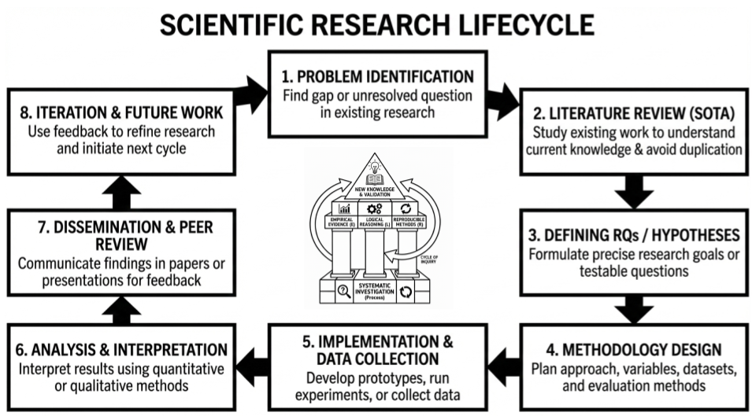

# Module 3: Scientific publications in IT & Structure of an Information Technology Research Manuscript, Experimental Implementation

<!-- TOC -->
* [Module 3: Scientific publications in IT & Structure of an Information Technology Research Manuscript, Experimental Implementation](#module-3-scientific-publications-in-it--structure-of-an-information-technology-research-manuscript-experimental-implementation)
  * [1. Scientific Publications in Information Technology (IT)](#1-scientific-publications-in-information-technology-it)
    * [1.1 Terminology](#11-terminology)
      * [1.1.1 Manuscript](#111-manuscript)
      * [1.1.2 Article](#112-article)
      * [1.1.3 Journal](#113-journal)
      * [1.1.4 Conference Proceedings](#114-conference-proceedings)
      * [1.1.5 Workshop Papers](#115-workshop-papers)
      * [1.1.6 Magazine Articles](#116-magazine-articles)
      * [1.1.7 Book Chapters](#117-book-chapters)
      * [1.1.8 Theses and Dissertations](#118-theses-and-dissertations)
    * [1.2 Role and Purpose of Scientific Publications](#12-role-and-purpose-of-scientific-publications)
      * [Purpose 1: Knowledge Dissemination](#purpose-1-knowledge-dissemination)
      * [Purpose 2: Establishing Priority and Claiming Discovery](#purpose-2-establishing-priority-and-claiming-discovery)
      * [Purpose 3: Facilitating Peer Review and Quality Control](#purpose-3-facilitating-peer-review-and-quality-control)
      * [Purpose 4: Forming an Archival Record](#purpose-4-forming-an-archival-record)
      * [Purpose 5: Enabling Academic Career Progression](#purpose-5-enabling-academic-career-progression)
      * [Purpose 6: Facilitating Collaboration and Community Building](#purpose-6-facilitating-collaboration-and-community-building)
    * [1.3 Types of Scientific Publications in IT](#13-types-of-scientific-publications-in-it)
      * [1.3.1 Primary Research Articles](#131-primary-research-articles)
      * [1.3.2 Review or Survey Papers](#132-review-or-survey-papers)
      * [1.3.3 Case Study / Empirical Papers](#133-case-study--empirical-papers)
      * [1.3.4 Technical Reports and Whitepapers](#134-technical-reports-and-whitepapers)
      * [1.3.5 Short Papers and Work-in-Progress Papers](#135-short-papers-and-work-in-progress-papers)
  * [2. Structure of an Information Technology Research Manuscript](#2-structure-of-an-information-technology-research-manuscript)
    * [2.1 Title](#21-title)
      * [Characteristics](#characteristics)
      * [Title Formulation Patterns](#title-formulation-patterns)
    * [2.2 Abstract](#22-abstract)
      * [Structure of a Good Abstract](#structure-of-a-good-abstract)
    * [2.3 Keywords](#23-keywords)
      * [Guidelines](#guidelines)
    * [2.4 Introduction](#24-introduction)
      * [Typical Structure (Funnel Approach)](#typical-structure-funnel-approach)
    * [2.5 Related Work / Literature Review](#25-related-work--literature-review)
      * [Objectives](#objectives)
    * [2.6 Methodology / Proposed System or Approach](#26-methodology--proposed-system-or-approach)
      * [Purpose](#purpose)
      * [In IT Research, This May Include](#in-it-research-this-may-include)
      * [Requirements](#requirements)
      * [3.2.3 Data Model](#323-data-model)
    * [2.8 Results and Discussion](#28-results-and-discussion)
      * [Components](#components)
      * [Discussion Should](#discussion-should)
    * [2.9 Conclusion and Future Work](#29-conclusion-and-future-work)
      * [Purpose](#purpose-1)
      * [Should Include](#should-include)
    * [2.10 References](#210-references)
      * [Requirements](#requirements-1)
      * [Tools](#tools)
    * [2.11 Logical Flow of an IT Research Manuscript](#211-logical-flow-of-an-it-research-manuscript)
  * [Case Study 1: System Implementation](#case-study-1-system-implementation)
<!-- TOC -->

---


## 1. Scientific Publications in Information Technology (IT)





**7. Dissemination & Peer Review**
- Communicating findings through papers, theses, reports, presentations
- Submitting to peer-reviewed venues (conferences, journals)
- Responding to critique and revising work based on feedback
- Sharing artifacts (code, data) for reproducibility

The outcome is **generalizable, verifiable, and reproducible knowledge**


Scientific publications are the primary mechanism for communicating validated research results in Information 
Technology (IT). They ensure that new findings, experimental results, system designs, and theoretical advancements are 
formally documented, peer-reviewed, and archived for the scientific community.

---

### 1.1 Terminology

Precise terminology is essential in academic and research communication.

| Term | Definition | Status | Length | Review Process |
|------|------------|--------|--------|----------------|
| **Manuscript** | Original unpublished work | Pre-publication | Varies | Not yet reviewed |
| **Preprint** | Manuscript shared publicly before peer review | Public but not certified | Varies | Not reviewed |
| **Article** | Published scholarly work | Published | 10-30 pages | Peer-reviewed |
| **Journal** | Periodical containing articles | Publication venue | N/A | Editorial + peer review |
| **Conference Proceedings** | Collection of presented papers | Publication venue | 4-12 pages per paper | Program committee review |
| **Paper** | Generic term for manuscript/article | Varies | Varies | Varies |


#### 1.1.1 Manuscript

A **manuscript** is the original version of a scholarly work before it has been formally published. It represents 
the author's research presented in a structured format, typically following the standard research manuscript structure 
(Title, Abstract, Introduction, etc.).

- It represents the pre-publication version of a study.
- It undergoes peer review and revision.
- It may exist as:
  - Submitted manuscript
  - Revised manuscript
  - Accepted manuscript

In IT research, an experimental study evaluating database backend performance would initially be written and submitted 
as a manuscript.

---

#### 1.1.2 Article

An **article** is the final, peer-reviewed, and published version of a manuscript.

- It appears in a journal or conference proceedings.
- It receives formal citation information (volume, issue, DOI). Assigned a permanent identifier (DOI - Digital Object Identifier)
- Formally published and citable
- Has undergone peer review (for scholarly articles)
- Part of the permanent scientific record

---

#### 1.1.3 Journal

A **journal** is a periodical publication dedicated to disseminating scholarly research in a specific field, containing 
articles. Journals publish issues periodically (monthly, quarterly, annually) and represent the archival record of 
scientific progress.

**Characteristics:**


- Slow publication cycle (months to years from submission to publication).
- Peer-review process is rigorous and often multiple rounds .
- Prioritizes depth, reproducibility, and theoretical contribution.
- Length is typically 10-30 pages per article.
- Prestige is measured by impact factor, citation metrics.


---

#### 1.1.4 Conference Proceedings

**Conference proceedings** are collections of papers presented at academic conferences. In computer science and IT, 
conferences are often the primary publication venue, unlike many other disciplines where journals dominate.

**Characteristics:**

- Faster publication cycle (3-6 months from submission to presentation).
- Peer-review process is rigorous but typically single-round.
- Emphasis on novelty and emerging results.
- Often shorter papers than journals (4-12 pages typical).
- Prestige is measured by acceptance rate, citation impact.
- Presentation of work at a scientific meeting.


#### 1.1.5 Workshop Papers

**Characteristics:**
- Very focused topics
- Shorter papers (2-6 pages)
- Less competitive acceptance
- Emphasis on discussion and feedback

**Best for:**
- Early-stage research
- PhD student work
- Emerging topics
- Getting feedback before conference submission

---

#### 1.1.6 Magazine Articles

**Characteristics:**
- Practitioner-oriented
- Less technical detail
- Broader audience

**Best for:**
- Summarizing research for broader audience
- Industry-focused contributions
- Opinion pieces on technology trends

---

#### 1.1.7 Book Chapters

**Characteristics:**
- Longer format (20-50 pages)
- Part of edited volume
- Comprehensive treatment of subtopic

**Best for:**
- Mature research areas
- Comprehensive surveys
- Positioning research in broader context

---

#### 1.1.8 Theses and Dissertations

**Characteristics:**
- Very long (100-300+ pages)
- Comprehensive documentation of PhD or Master's research
- Not peer-reviewed beyond advisor and committee

**Purpose:**
- Demonstrate research competence
- Document complete body of work
- Requirement for degree completion


---


### 1.2 Role and Purpose of Scientific Publications

#### Purpose 1: Knowledge Dissemination

The most fundamental purpose is to share new knowledge with the scientific community and beyond.

**In IT research, this means:**
- Describing new algorithms, architectures, or methodologies
- Reporting experimental results and empirical findings
- Sharing negative results (what doesn't work) to prevent wasted effort
- Enabling others to build upon the work


---

#### Purpose 2: Establishing Priority and Claiming Discovery

Scientific publication establishes who discovered something first.

**The "first to publish" principle:**
- The publication date establishes priority of discovery
- Citation credit goes to the first publisher
- Preprint servers (arXiv, TechRxiv) now provide even earlier priority claims


---

#### Purpose 3: Facilitating Peer Review and Quality Control

Peer review is evaluation of academic work by independent experts to ensure **quality, validity, and 
scientific rigor** before publication.


**Peer review functions:**
- **Validation:** Experts verify methodology and conclusions
- **Improvement:** Reviewers suggest enhancements
- **Filtering:** Low-quality work is rejected
- **Certification:** Publication signals quality to the community

**Peer review models:**

| Model | Description | Used In |
|-------|-------------|---------|
| Single-blind | Reviewers know authors, authors don't know reviewers | Most journals |
| Double-blind | Reviewers and authors anonymous to each other | Many conferences |
| Open review | Identities revealed | Emerging venues |

---

#### Purpose 4: Forming an Archival Record

Publications form a permanent, citable record of scientific progress.

**Functions of the archival record:**
- Enables tracing the evolution of ideas
- Provides foundation for literature reviews
- Supports meta-analyses and systematic reviews
- Preserves knowledge for future generations


---

#### Purpose 5: Enabling Academic Career Progression

Publications are the primary metric for academic evaluation.

**Used for:**
- PhD graduation requirements
- Faculty hiring and promotion
- Research funding decisions
- Department and university rankings

**Metrics derived from publications:**
- **Publication count:** Quantity of output
- **Citation count:** Impact on the field
- **h-index:** Combined measure of productivity and impact

---

#### Purpose 6: Facilitating Collaboration and Community Building

Publications connect researchers with shared interests.

**Community functions:**
- Identifying potential collaborators
- Finding experts for peer review
- Building research networks
- Establishing research communities around topics


---

### 1.3 Types of Scientific Publications in IT

Not all papers serve the same purpose. Researchers generate different types of documents depending on the depth and 
goal of their study.

#### 1.3.1 Primary Research Articles

The most common type. These papers describe an original study where the authors develop a new algorithm, system, or theory.

Example: The original paper by Cerf and Kahn (1974) that formulated TCP/IP.

#### 1.3.2 Review or Survey Papers

These do not originate new data. Instead, they summarize and analyze dozens of existing primary articles to map out 
the current state of a field.

Purpose: To help new researchers understand the "Big Picture" of a domain like Machine Learning Security.

#### 1.3.3 Case Study / Empirical Papers

These focus on validating and refining existing knowledge in a real-world context.

Example: Case study 1 comparing PostgreSQL and MongoDB performance. This provides samples of how theoretical 
systems behave under specific stress.

#### 1.3.4 Technical Reports and Whitepapers
Often published by organizations (like Google, Microsoft, or IBM) or universities to share early-stage ideas or specific
technical implementations that may not yet be ready for a formal journal.

#### 1.3.5 Short Papers and Work-in-Progress Papers

- Present preliminary findings.
- Allow early feedback from the research community.

---


## 2. Structure of an Information Technology Research Manuscript

A scientific research manuscript in Information Technology follows a structured format to ensure clarity, reproducibility, 
transparency, and logical presentation of contributions. This structure enables researchers, reviewers, and 
practitioners to understand the problem, methodology, experimental design, results, and scientific contribution.

The typical structure of an IT research manuscript includes:

| Section | Purpose |
|---------|---------|
| Title | Concise description of the research |
| Abstract | Summary of the entire paper |
| Keywords | Discoverability terms |
| Introduction | Problem motivation and context |
| Related Work | Literature positioning |
| Methodology | Technical approach description |
| Experimental Setup | Evaluation design and conditions |
| Results and Discussion | Findings and interpretation |
| Conclusion and Future Work | Summary and extensions |
| References | Citation sources |

---

### 2.1 Title


The title provides a concise and precise description of the research contribution.

#### Characteristics
- 10-15 words recommended
- Includes key variables and subject of study
- Uses keywords that aid discoverability

#### Title Formulation Patterns

In Information Systems, titles typically follow one of two patterns:

**Pattern 1:** [What] + [In Relation To What] + [How / Under What Conditions]

**Pattern 2:** [Artifact/Subject] + [Variable] + [Method/Context/Purpose/Approach]

**Examples with Pattern Mapping**

**Example 1:**
> **Title:** Experimental Performance Evaluation of a RESTful Service with Different Database Backends Under High Load

**Pattern 1 Mapping:**
- What → RESTful Service
- In Relation To What → Different Database Backends
- How / Condition → Experimental Evaluation Under High Load

**Pattern 2 Mapping:**
- Artifact → RESTful Service
- Variable → Database Backends
- Method/Context → Experimental Performance Evaluation Under High Load

---

**Example 2:**
> **Title:** Impact of Database Backend Choice on RESTful Service Latency and Throughput: A Controlled High-Load Experiment

**Pattern 1 Mapping:**
- What → RESTful Service
- In Relation To What → Database Backend Choice
- How / Condition → Controlled Experiment Under High Load

**Pattern 2 Mapping:**
- Artifact → RESTful Service
- Variable → Database Backend Choice
- Method/Context → Controlled High-Load Experiment

---

**Example 3:**
> **Title:** Controlled Experimental Study of RESTful Service Performance Using In-Memory and PostgreSQL Backends Under High Concurrency

**Pattern 1 Mapping:**
- What → RESTful Service
- In Relation To What → In-Memory and PostgreSQL Backends
- How / Condition → Controlled Experimental Study Under High Concurrency

**Pattern 2 Mapping:**
- Artifact → RESTful Service
- Variable → In-Memory vs PostgreSQL Backends
- Method/Context → Controlled Experimental Study Under High Concurrency

---

**Example 4:**
> **Title:** Evaluating the Effect of Database Backend Selection on RESTful Service Performance Under High Load

**Pattern 1 Mapping:**
- What → RESTful Service
- In Relation To What → Database Backend Selection
- How / Condition → Empirical Evaluation Under High Load

**Pattern 2 Mapping:**
- Artifact → RESTful Service
- Variable → Database Backend Selection
- Method/Context → Empirical Evaluation Under High Load

---

**Example 5:**
> **Title:** Comparative Performance Analysis of RESTful Services with In-Memory and PostgreSQL Databases in High-Load Environments

**Pattern 1 Mapping:**
- What → RESTful Services
- In Relation To What → In-Memory and PostgreSQL Databases
- How / Condition → Comparative Analysis in High-Load Environments

**Pattern 2 Mapping:**
- Artifact → RESTful Services
- Variable → In-Memory vs PostgreSQL Databases
- Method/Context → Comparative Performance Analysis in High-Load Environments

---

### 2.2 Abstract


The abstract summarizes the entire paper in a single paragraph (typically 150-250 words).

#### Structure of a Good Abstract
- Problem statement / Background
- Research objective
- Methodology
- Experimental setup
- Key results
- Main conclusion

**Best Practices**
- Write last, after completing the manuscript
- Include quantitative results (specific numbers when possible)
- Maximum 250-300 words (journal-dependent)
- Avoid citations and undefined abbreviations

**Case Study Example**

> [**Background:**] The choice of database backend significantly impacts the performance of RESTful services, yet limited empirical evidence exists comparing modern in-memory databases with traditional disk-based systems under controlled conditions.
>
> [**Objective:**] This study investigates whether replacing PostgreSQL with an in-memory database improves latency and throughput for RESTful services under identical workloads.
>
> [**Method:**] We deployed identical RESTful service instances with two database configurations: Treatment A (in-memory database) and Treatment B (PostgreSQL as baseline). Using Artillery as a load-testing tool, we generated controlled workloads and measured p50, p95, and p99 latency percentiles, throughput (requests/second), and error rates across multiple test runs.
>
> [**Results:**] The in-memory configuration demonstrated 45% lower p95 latency (12ms vs. 22ms) and 2.3× higher throughput (1,850 RPS vs. 804 RPS) compared to PostgreSQL under high load, with comparable error rates (<0.1%). Statistical analysis confirmed significance (p < 0.01).
>
> [**Conclusion:**] In-memory databases provide superior performance for high-throughput, low-latency requirements where data persistence is not the primary concern, offering actionable insights for system architects making technology choices.

---

### 2.3 Keywords


Keywords improve discoverability in digital libraries and indexing databases.

#### Guidelines
- 4-6 keywords
- Specific technical terms
- Avoid overly general words

**Case Study Example**
> RESTful API; Performance Evaluation; In-Memory Database; PostgreSQL; Load Testing; Database Comparison

---

### 2.4 Introduction


Introduces the research problem and motivates the study.

#### Typical Structure (Funnel Approach)
1. **Background:** Start with the broader importance of the topic
2. **Problem Statement:** Identify the specific gap or challenge
3. **Related Work Summary:** Briefly acknowledge what's known
4. **Research Gap:** Clearly state what's missing
5. **Objective/Purpose:** Present your study's aim
6. **Contribution:** List what the paper adds
7. **Roadmap:** Briefly outline paper structure

**Case Study Example**

> Modern web applications increasingly rely on RESTful services as their architectural backbone [1, 2]. 
> The performance of these services—particularly latency and throughput—directly impacts user experience and 
> operational costs [3]. Among the many factors affecting service performance, database backend selection represents 
> a critical architectural decision that system architects must navigate.
>
> Traditional disk-based relational databases like PostgreSQL have long served as the industry standard for data 
> persistence [4]. 
> However, the emergence of in-memory databases promises significant performance improvements by eliminating disk I/O 
> bottlenecks [5]. While theoretical advantages are well-documented, limited empirical research directly compares these 
> technologies under controlled, reproducible conditions with identical RESTful service implementations.
>
> This study addresses this gap through a controlled experiment comparing two database backends: an in-memory database 
> (Treatment A) versus PostgreSQL (Treatment B, serving as baseline). We investigate whether, and to what extent, 
> in-memory databases improve key performance metrics under identical workload conditions.
>
>The main contributions of this study are as follows:
>(1) providing empirical performance evidence comparing the selected database technologies;
>(2) proposing a reproducible and systematic benchmarking methodology for RESTful services; and
>(3) delivering practical, data-driven insights to support informed database selection decisions by system architects.
> 
> Section 2 reviews related work; Section 3 details our experimental methodology; Section 4 presents results; Section 5 discusses implications; Section 6 concludes with future work directions.

---

### 2.5 Related Work / Literature Review


Positions the research within existing scientific literature.

#### Objectives
- Summarize relevant prior studies
- Compare methodologies and findings
- Identify research gaps
- Justify the novelty of the proposed work

**Best Practices**
- Organize thematically, not chronologically
- Critically evaluate, don't just summarize
- Identify gaps your research fills
- Use recent sources (last 3-5 years for fast-moving fields)
- Show how your work builds on/diverges from existing research
- Include both supporting and contrasting studies
- Use reputable sources (journals, conferences)

**Case Study Example**

> **2.1 Database Performance Benchmarking**
>
> Existing database benchmarking research has primarily focused on isolated database systems rather than integrated service architectures. Gray et al. [6] established foundational transaction processing benchmarks (TPC-C, TPC-H) that remain industry standards for database performance comparison. However, these benchmarks evaluate databases in isolation, without considering the overhead of RESTful service layers.
>
> **2.2 RESTful Service Performance Factors**
>
> Research by Fielding [7] and subsequent studies [8, 9] identified multiple factors affecting RESTful service performance, including serialization formats, payload sizes, and network latency. Chen et al. [10] demonstrated that database response time constitutes the primary bottleneck in typical service architectures, accounting for 60-75% of total request latency. This finding motivates our focus on database backend comparison.
>
> **2.3 In-Memory Database Studies**
>
> Studies by Plattner [11] and Zhang et al. [12] demonstrated theoretical performance advantages of in-memory databases, showing 10-100× speed improvements for specific query patterns. However, these studies used synthetic database workloads rather than realistic RESTful service patterns. More recently, Kumar and Singh [13] compared Redis (in-memory) with MySQL for a simple web application, finding 3× throughput improvement, but their study lacked controlled experimental conditions and did not report latency percentiles beyond averages.
>
> **2.4 Research Gap**
>
> Despite the growing adoption of both RESTful architectures and in-memory databases, no published study has provided a controlled, apples-to-apples comparison of identical RESTful services with different database backends under identical workload conditions. Existing research either isolates the database layer or fails to control for confounding variables. Our study addresses this gap by implementing identical service logic with only the database backend varying, measuring standardized performance metrics under controlled load.

---

### 2.6 Methodology / Proposed System or Approach

#### Purpose
Describes how the research problem is addressed.

#### In IT Research, This May Include
- System architecture
- Algorithm design
- RESTful service design
- Repository pattern implementation
- Data processing workflow
- Mathematical formulation (if applicable)

#### Requirements
- Clear diagrams (architecture diagrams, flowcharts)
- Precise technical details
- Sufficient detail for reproducibility
- Justify design choices
- Identify variables clearly
- Explain treatment implementation
- Address validity threats

**Case Study Example**


> 3. Proposed System Architecture
> 
> 3.1 System Overview
> 
> This study proposes a controlled experimental framework for evaluating the performance of RESTful services with 
> different database backends. The approach consists of three primary components: (1) a RESTful service implementation 
> with interchangeable database connectors, (2) two distinct database backend configurations (in-memory and PostgreSQL), 
> and (3) a workload generation and metrics collection framework. Figure 1 illustrates the high-level architecture of 
> the proposed experimental system.
> 
> **Figure 1.** System Architecture for Comparative Database Performance Evaluation
> 
> 3.2 RESTful Service Design
> 3.2.1 Service Architecture
> The RESTful service is implemented using Node.js (version 18.12) with the Express framework (version 4.18). This technology stack was selected due to its widespread adoption in industry, mature ecosystem, and non-blocking I/O model that enables high-concurrency handling—characteristics representative of modern RESTful service implementations.

>The service exposes five standard RESTful endpoints that mirror typical CRUD operations found in production systems:
>
> - `GET /users` - retrieve all users (read operation)
> - `GET /users/:id` - retrieve single user (read)
> - `POST /users` - add new user (write)
> - `PUT /users/:id` - update user (write)
> - `DELETE /users/:id` - delete user (write)
> 
> 
> 


> 3.2.2 Database Abstraction Layer

To ensure that the database backend is the only variable between treatment conditions, the service implements a database abstraction layer that provides identical interfaces regardless of the underlying database. This layer encapsulates:

- **Connection management:** Pool configuration (minimum 5, maximum 20 connections)
- **Query construction:** Parameterized queries to prevent SQL injection and ensure consistency
- **Data mapping:** Transformation of database results to uniform JSON responses
- **Error handling:** Consistent error propagation and logging

The abstraction layer implements the Repository pattern, isolating data access logic from business logic and enabling seamless switching between database backends without modifying the core service logic.

#### 3.2.3 Data Model

Both database implementations share an identical user schema:

```javascript
{
  id: { type: 'integer', primaryKey: true, autoIncrement: true },
  name: { type: 'string', length: 100, required: true },
  email: { type: 'string', length: 255, required: true, unique: true },
  createdAt: { type: 'timestamp', defaultValue: 'now()' },
  updatedAt: { type: 'timestamp', defaultValue: 'now()' }
}
```


---

### 2.8 Results and Discussion


Presents and interprets experimental findings.

#### Components
- Tables and graphs
- Statistical outputs
- Comparison between approaches
- Interpretation of performance trade-offs

#### Discussion Should
- Explain why results occurred
- Connect findings to hypotheses
- Compare results with related work
- Identify limitations
- Present results objectively before interpreting
- Report statistical significance and effect sizes
- Discuss unexpected findings
- Explain practical implications

**Case Study Example**

> **5.1 Latency Results**
>
> Table 1 presents latency percentiles for both database backends across 10 benchmark runs.
>
> | Metric | PostgreSQL (ms) | In-Memory (ms) | Improvement |
> |--------|-----------------|----------------|-------------|
> | p50    | 8.3 (±1.2)      | 4.1 (±0.8)     | 50.6%       |
> | p95    | 22.4 (±3.1)     | 12.3 (±1.9)    | 45.1%       |
> | p99    | 45.7 (±5.8)     | 21.9 (±3.2)    | 52.1%       |
>
> The in-memory configuration demonstrated consistently lower latency across all percentiles. Mann-Whitney U tests confirmed significant differences for all three metrics (p < 0.001). The 95th percentile improvement (45%) is particularly relevant for service-level agreements, as it represents the experience of users at the tail of the distribution.
>
> **5.2 Throughput Results**
>
> Average throughput for PostgreSQL was 804 RPS (SD = 76), compared to 1,850 RPS (SD = 112) for the in-memory database—a 2.3× improvement. The independent samples t-test showed statistical significance (t(18) = 24.3, p < 0.001) with a very large effect size (Cohen's d = 10.8).
>
> **5.3 Error Rates**
>
> Both configurations maintained error rates below 0.1% (PostgreSQL: 0.08%, In-Memory: 0.03%). The difference was not statistically significant (p = 0.42), indicating that performance improvements did not come at the cost of reliability.
>
> **5.4 Resource Utilization**
>
> Despite higher throughput, the in-memory configuration showed lower CPU utilization (62% vs. 78% for PostgreSQL) and negligible I/O wait (0.5% vs. 15.3%). This aligns with expectations: eliminating disk I/O reduces both latency and CPU overhead from I/O scheduling.
>
> **5.5 Discussion**
>
> Our results support H₁ and reject H₀: the in-memory database provides significantly lower latency and higher throughput under identical workload conditions. These findings align with theoretical predictions [5, 11] but provide novel empirical evidence within a realistic RESTful service context.
>
> The magnitude of improvement (2.3× throughput, 45% lower p95 latency) exceeds some prior estimates [13], likely due to our controlled methodology isolating the database as the sole variable. The minimal difference in error rates demonstrates that performance gains do not compromise reliability.
>
> **5.6 Practical Implications**
>
> For system architects, these results suggest:
> 1. In-memory databases should be strongly considered for read-heavy RESTful services with strict latency requirements
> 2. The 2.3× throughput improvement could translate to significant infrastructure cost savings
> 3. The trade-off involves data durability—in-memory databases typically require complementary persistence strategies
>
> **5.7 Limitations**
>
> This study's limitations include:
> - Single workload pattern (80/20 read/write ratio)
> - Fixed data size (10,000 records)
> - Specific database products (Redis, PostgreSQL)
> - Cloud environment (AWS) may not generalize to on-premise

---

### 2.9 Conclusion and Future Work

#### Purpose
Summarizes contributions and outlines research extensions.

#### Should Include
- Restatement of the research objective
- Summary of main findings
- Confirmation or rejection of hypotheses
- Practical implications
- Limitations
- Suggestions for future research
- Avoid introducing new data or references

**Case Study Example**

> **6.1 Conclusion**
>
> This study investigated whether the choice of database backend affects RESTful service performance through a controlled experiment comparing in-memory (Redis) and PostgreSQL backends under identical workload conditions. Our results demonstrate that the in-memory configuration achieved 45% lower p95 latency and 2.3× higher throughput while maintaining comparable error rates. These differences were statistically significant with large effect sizes.
>
> The findings confirm that in-memory databases offer substantial performance advantages for RESTful services, particularly in read-heavy scenarios where low latency and high throughput are prioritized over immediate data durability. This empirically validates the common industry practice of using in-memory caches or databases for performance-critical service tiers.
>
> **6.2 Contributions**
>
> This research contributes:
> 1. Reproducible benchmarking methodology for RESTful service database comparison
> 2. Empirical performance data quantifying the in-memory advantage
> 3. Practical guidance for system architects facing database selection decisions
>
> **6.3 Future Work**
>
> Several directions warrant further investigation:
> - **Workload variation:** Testing write-heavy patterns (20/80 read/write) and mixed transactional workloads
> - **Scale effects:** Evaluating performance with larger datasets (1M+ records) and varying database sizes
> - **Alternative technologies:** Comparing other in-memory options (Memcached, Hazelcast) and other disk-based databases (MySQL, MongoDB)
> - **Persistence impact:** Investigating the performance cost of enabling persistence features in in-memory databases
> - **Distributed deployments:** Evaluating performance in clustered configurations with network partitioning
> - **Cost modeling:** Developing frameworks to translate performance differences into infrastructure cost implications

---

### 2.10 References


Provides full citation of all referenced works.

#### Requirements
- Follow a consistent citation style (IEEE, ACM, APA, etc.)
- Cite only credible scientific sources
- Ensure in-text citations match reference list
- Avoid plagiarism

#### Tools
- Mendeley
- Zotero
- BibTeX with LaTeX
- Overleaf reference management

**Best Practices**
- Use consistent citation style (IEEE, ACM, APA as required)
- Include DOIs when available
- Prioritize peer-reviewed sources
- Balance classic and recent citations
- Verify all citations are cited in text

**Case Study Example (IEEE Style)**

> [1] R. T. Fielding and R. N. Taylor, "Principled design of the modern Web architecture," *ACM Transactions on Internet Technology*, vol. 2, no. 2, pp. 115-150, May 2002.
>
> [2] L. Richardson and S. Ruby, *RESTful Web Services*. Sebastopol, CA: O'Reilly Media, 2007.
>
> [3] D. F. García, J. García, J. Entrialgo, M. García, P. Valledor, R. García, and A. M. Campos, "A study of the effect of latency on user perception of web application performance," in *Proceedings of the 2018 IEEE/ACM International Conference on Utility and Cloud Computing*, 2018, pp. 123-132.
>
> [4] PostgreSQL Global Development Group, "PostgreSQL 14 Documentation," 2022. [Online]. Available: https://www.postgresql.org/docs/14/
>
> [5] H. Garcia-Molina and K. Salem, "Main memory database systems: An overview," *IEEE Transactions on Knowledge and Data Engineering*, vol. 4, no. 6, pp. 509-516, Dec. 1992.
>
> [6] J. Gray et al., "The benchmark handbook for database and transaction processing systems," Morgan Kaufmann Publishers, 1993.
>
> [7] R. T. Fielding, "Architectural styles and the design of network-based software architectures," Ph.D. dissertation, University of California, Irvine, 2000.
>
> [8] C. Pautasso, O. Zimmermann, and F. Leymann, "RESTful web services vs. 'big' web services: Making the right architectural decision," in *Proceedings of the 17th International Conference on World Wide Web*, 2008, pp. 805-814.
>
> [9] S. Tilkov, "RESTful Web Services vs. Web Services: Making the Right Architectural Decision," InfoQ, 2007.
>
> [10] Y. Chen, S. Iyer, X. Liu, D. Milojicic, and A. Sahai, "Translating service level objectives to lower level policies for multi-tier services," *Cluster Computing*, vol. 11, no. 3, pp. 299-311, 2008.
>
> [11] H. Plattner, "A common database approach for OLTP and OLAP using an in-memory column database," in *Proceedings of the 2009 ACM SIGMOD International Conference on Management of Data*, 2009, pp. 1-2.
>
> [12] H. Zhang, G. Chen, B. C. Ooi, K. L. Tan, and M. Zhang, "In-memory big data management and processing: A survey," *IEEE Transactions on Knowledge and Data Engineering*, vol. 27, no. 7, pp. 1920-1948, July 2015.
>
> [13] A. Kumar and P. Singh, "Performance comparison of MySQL and Redis as backend databases for REST APIs," *International Journal of Computer Applications*, vol. 175, no. 12, pp. 25-30, 2020.
>
> [14] R. Nishtala et al., "Scaling Memcache at Facebook," in *Proceedings of the 10th USENIX Symposium on Networked Systems Design and Implementation*, 2013, pp. 385-398.


[References in BibTeX Format](../resources/docs/references.bib)

>BibTeX is a reference management system used primarily with LaTeX to format citations and bibliographies automatically.


---

### 2.11 Logical Flow of an IT Research Manuscript

**Problem → Literature Gap → Proposed Method → Experimental Design → Results → Interpretation → Contribution**

This logical flow ensures that:
- The research problem is clearly established
- The gap in existing knowledge is identified
- The method addresses the gap
- The experimental design tests the hypothesis
- Results are objectively presented
- Interpretation connects findings back to the problem
- Contributions are clearly stated

## Case Study 1: System Implementation

[Case Study 1: Database Backend Performance in a RESTful Service](../module2/case-study-1-assignment1/README.md#case-study-1-performance-evaluation-of-restful-service-with-different-database-backends)
