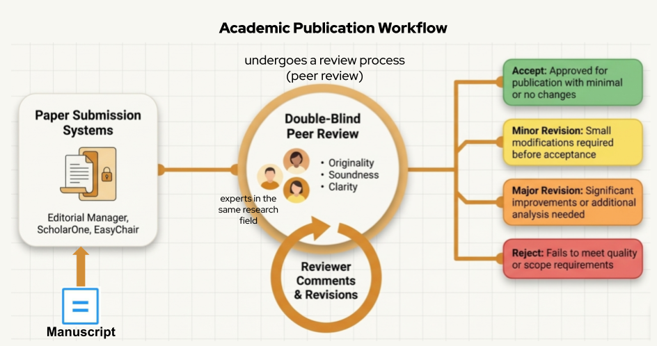
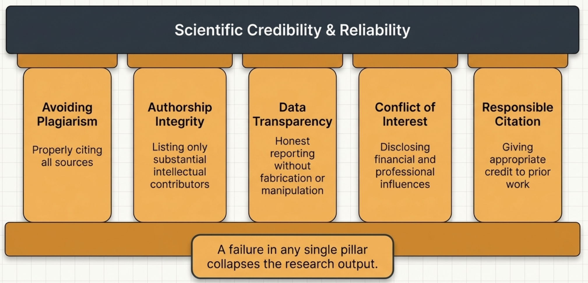
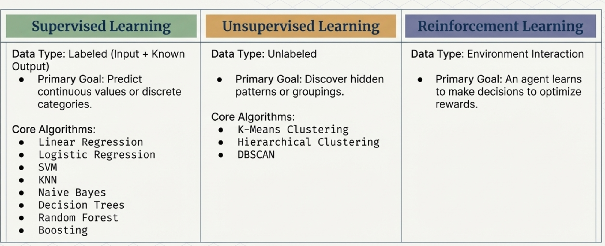
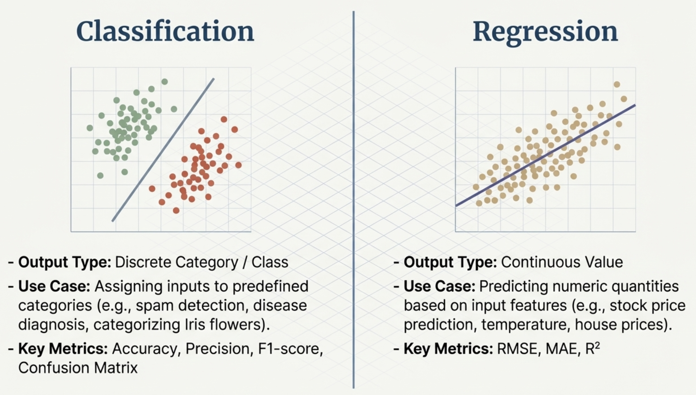
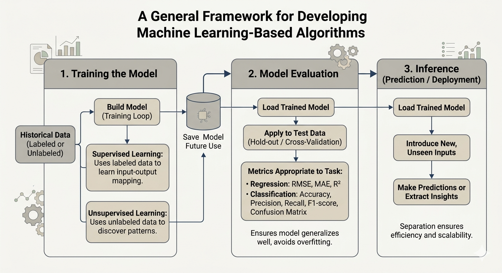
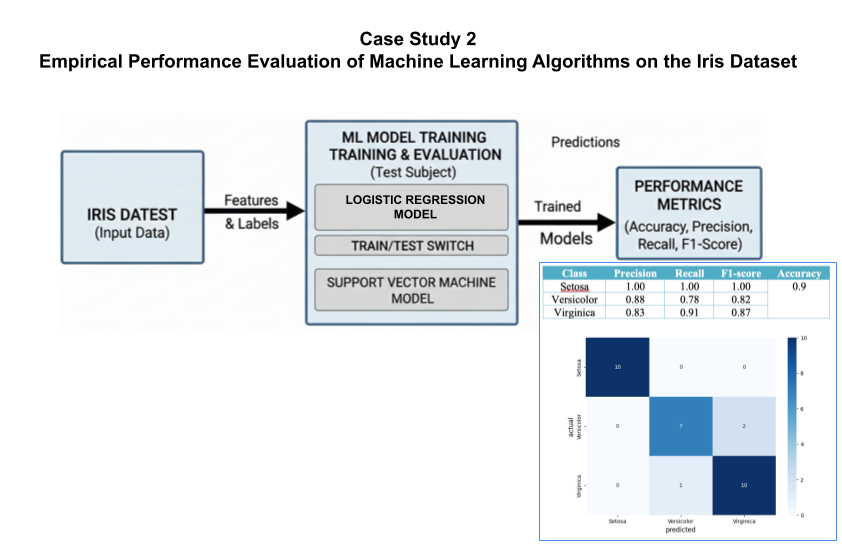
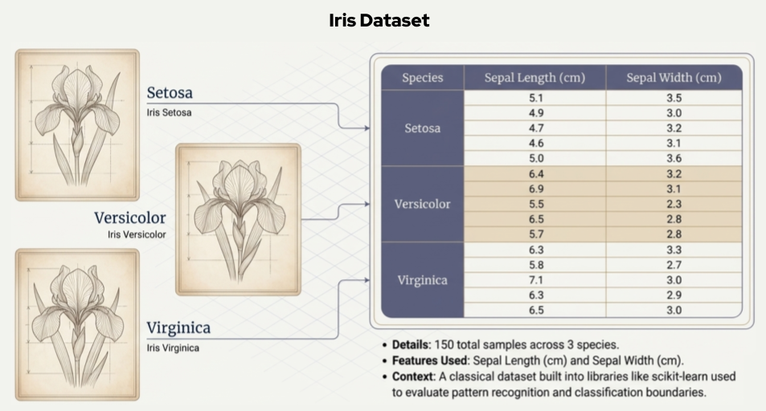
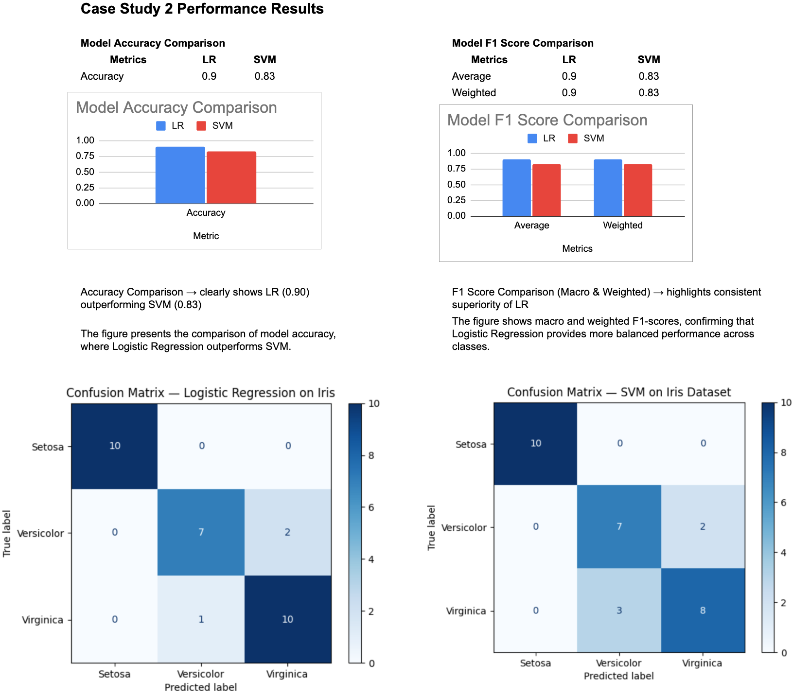

# Module 4: Academic Publication Process, Data-Driven Research in IT

<!-- TOC -->
* [Module 4: Academic Publication Process, Data-Driven Research in IT](#module-4-academic-publication-process-data-driven-research-in-it)
  * [Academic Publication Workflow](#academic-publication-workflow)
    * [Paper Submission Systems](#paper-submission-systems)
    * [Peer-Review Process](#peer-review-process)
    * [Reviewer Comments and Revisions](#reviewer-comments-and-revisions)
    * [Editorial Decisions](#editorial-decisions)
  * [Ethical Considerations in Academic Publishing](#ethical-considerations-in-academic-publishing)
  * [Case Study 2 (Part A): Data-Driven and Algorithmic Research in IT](#case-study-2-part-a-data-driven-and-algorithmic-research-in-it)
    * [Data-Driven Research in Information Technology](#data-driven-research-in-information-technology)
    * [Introduction To Machine Learning?](#introduction-to-machine-learning)
      * [Types of Machine Learning Algorithms](#types-of-machine-learning-algorithms)
      * [Supervised Learning Algorithms](#supervised-learning-algorithms)
      * [Unsupervised Learning Algorithms](#unsupervised-learning-algorithms)
      * [Neural Networks & Deep Learning](#neural-networks--deep-learning)
    * [A General Framework for Developing Machine Learning-Based Algorithms](#a-general-framework-for-developing-machine-learning-based-algorithms)
    * [Case Study: Linear Regression for Estimating House Prices](#case-study-linear-regression-for-estimating-house-prices)
    * [Comparative Evaluation of Machine Learning Algorithms Using the Iris Dataset](#comparative-evaluation-of-machine-learning-algorithms-using-the-iris-dataset)
      * [Iris Dataset](#iris-dataset)
      * [Logistic Regression](#logistic-regression)
<!-- TOC -->


## Academic Publication Workflow

The academic publication workflow describes the standard process through which research manuscripts are evaluated and published in journals or conference proceedings.

</img>


### Paper Submission Systems

Most academic journals and conferences use online submission platforms such as Editorial Manager, ScholarOne, or EasyChair. These systems allow authors to submit manuscripts, upload supplementary materials, track the review process, and communicate with editors.

### Peer-Review Process

After submission, the manuscript undergoes peer review, where independent experts in the same research field evaluate the work. Reviewers assess the originality, methodological soundness, clarity, and contribution of the research.

### Reviewer Comments and Revisions

Reviewers provide detailed feedback and suggestions for improvement. Authors are typically required to revise the manuscript and respond to reviewer comments. Revisions may involve clarifying methodology, improving analysis, or correcting errors.

### Editorial Decisions

Based on reviewer evaluations, the editor makes one of the following decisions:

- **Accept:** The paper is approved for publication with minimal or no changes.
- **Minor revision:** Small modifications are required before acceptance.
- **Major revision:** Significant improvements or additional analysis are needed.
- **Reject:** The manuscript does not meet the journal's quality or scope requirements.

---

## Ethical Considerations in Academic Publishing

Ethical practices are essential to maintain integrity and trust in scientific research. 
Key ethical considerations include:

</img>


- **Avoiding plagiarism:** Properly citing and acknowledging all sources.
- **Authorship integrity:** Listing only contributors who made substantial intellectual contributions.
- **Data transparency:** Reporting methods and results honestly without fabrication or manipulation.
- **Conflict of interest disclosure:** Revealing any financial or professional interests that could influence the research.
- **Responsible citation practices:** Giving appropriate credit to prior work.

Adhering to these principles ensures credibility and reliability in academic publications.

---

## Case Study 2 (Part A): Data-Driven and Algorithmic Research in IT

### Data-Driven Research in Information Technology

Data-driven research focuses on extracting insights, patterns, or predictions from data using computational methods and 
algorithms. 

Artificial Intelligence (AI) and Machine Learning(ML) are commonly used within this approach.


The research process typically involves collecting or selecting a dataset, preprocessing the data, applying algorithms 
or analytical models, and evaluating the results using appropriate performance metrics. These metrics may include 
accuracy, precision, recall, F1-score, or other domain-specific measures.

Data-driven research enables researchers to develop intelligent systems, improve decision-making processes, and 
uncover hidden relationships within large-scale datasets.


### Introduction To Machine Learning?

Artificial Intelligence (AI) is a broad field of computer science focused on building machines behave like humans — 
think, learn, reason, and solve problems.


AI systems aim to mimic human thinking — whether through rules, learning, or problem-solving.


Machine Learning (ML) is a subfield of Artificial Intelligence (AI) focused on developing algorithms that can learn
from data and generalize to new, unseen data. This allows systems to perform tasks without being explicitly programmed. 
So, ML is a way to teach computers to learn from data instead of giving them step-by-step instructions.


#### Types of Machine Learning Algorithms

Machine learning algorithms can generally be grouped into three major categories: supervised learning,
unsupervised learning, and reinforcement learning.

</img>


**Supervised Learning**

In supervised learning, models are trained on labeled data — where both input and output are known.
Supervised learning problems are generally divided into two main types:

</img>

- **Classification problem**  
  Used when the output is a discrete category or class.
  The goal is to assign inputs to one of several predefined categories.

    * Predicts **discrete categories** (e.g., classifying an iris flower as *Setosa*, *Versicolor*, or *Virginica*).
    * **Example:** Spam detection, disease diagnosis.

- **Regression problem**  
  Used when the output is a continuous value.
  The model predicts a numeric quantity based on the input features.
    * Predicts **continuous values** (e.g., predicting house prices based on area and location).
    * **Example:** Stock price prediction, temperature forecasting.

    
**Unsupervised Learning**

Unsupervised learning deals with unlabeled data — the goal is to find hidden patterns or groupings.

- **Clustering problem**  
  Groups similar data points based on similarity (e.g., grouping flowers into species based on petal measurements without predefined labels).  
  **Example:** Grouping emails into categories without predefined labels, customer profiling, market segmentation, clustering similar users....

**Reinforcement Learning**

Reinforcement learning (RL) is a type of machine learning where an agent learns to make decisions by interacting with an environment.

#### Supervised Learning Algorithms

**Linear Regression**

- Predicts a continuous numeric output.
- Fits a line that minimizes the sum of squared errors.

**Logistic Regression**

- Used for binary classification.
- Uses a sigmoid function to predict probabilities.

**Support Vector Machine (SVM)**

- Classifies data by finding the optimal decision boundary.
- Uses kernel functions for non-linear classification.

**K-Nearest Neighbors (KNN)**

- Non-parametric algorithm for regression and classification.
- Predicts based on the average (or majority) of K nearest neighbors.

**Naive Bayes**

- Based on Bayes’ Theorem.
- Assumes feature independence.
- Common in spam filtering.

**Decision Trees**

- Series of conditional questions leading to a prediction.
- Splits data based on feature values.

**Random Forest**

- Ensemble of multiple decision trees.
- Reduces overfitting by averaging results.

**Boosting (e.g., AdaBoost, XGBoost)**

- Trains models sequentially.
- Each model focuses on correcting the errors of the previous one.


#### Unsupervised Learning Algorithms

**Clustering**

- Groups similar data points.

**K-Means**

- Partitions data into K clusters based on proximity.
- Iteratively updates cluster centers.

**Others**

- Hierarchical Clustering
- DBSCAN

#### Neural Networks & Deep Learning

- Inspired by the human brain, composed of layers (input, hidden, output).
- Learns hidden features and complex patterns automatically.
- Deep Learning = multiple hidden layers.
- Common in image and speech recognition.
- Can be used for classification, regression. With unsupervised variations like Autoencoders, Self-Organizing Maps (SOMs), and Deep Embedded Clustering (DEC) allow ANNs to perform clustering.


### A General Framework for Developing Machine Learning-Based Algorithms

In a typical machine learning application, the procedure is composed of **three main steps**:

</img>

1. **Training the Model**  
   - Use historical data to build the model, then save it for future use.  
   - Supervised learning uses labeled data to learn the mapping between inputs and outputs.  
   - Unsupervised learning uses unlabeled data to discover patterns or structure.

2. **Model Evaluation**  
   - Before deployment, the trained model should be evaluated using metrics appropriate to the task:  
     - **Regression:** RMSE, MAE, R²  
     - **Classification:** Accuracy, Precision, Recall, F1-score, Confusion Matrix  
   - Evaluation can be performed using hold-out validation, cross-validation, or other resampling techniques.  
   - This step ensures the model generalizes well to unseen data and avoids overfitting.

3. **Inference (Prediction / Deployment)**  
   - Load the trained model and introduce new, unseen inputs to make predictions or extract insights.  
   - The separation of training, evaluation, and inference ensures efficiency and scalability in practical applications.


### Case Study: Linear Regression for Estimating House Prices

Training involves adjusting the model coefficients (b0, b1, b2) to minimize the prediction error, 
thereby determining the line of best fit.

y = b0 + b1 * x1 + b2 * x2 + error

Where:
- y  = house price  
- x1 = area  
- x2 = number of bedrooms  
- b0 = intercept  
- b1, b2 = coefficients  


**Training&Evaluation Algorithm**


1. Start
Initialize the process for training the linear regression model.

---

2. Define Training Data

**Input feature matrix `X_train`** (independent variables):
- Area in square meters (m²)
- Number of bedrooms

**Output target vector `y_train`** (dependent variable):
- Corresponding house prices in million KZT

---

3. Define Test Data

**Input feature matrix `X_test`** (unseen houses, never used in training):
- Area in square meters (m²)
- Number of bedrooms

**Ground-truth target vector `y_test`**:
- Realistic house prices in million KZT based on training trends

---

4. Initialize a Linear Regression Model
The model will learn the best-fit plane:
```
price = a × area_m2 + b × bedrooms + c
```

Where `a`, `b` are coefficients and `c` is the intercept.

---

5. Train the Model
```
model.fit(X_train, y_train)
```
During training the model:
1. Initializes default coefficients `(a, b, c)`
2. Predicts prices on training data
3. Measures prediction error (residuals)
4. Adjusts coefficients to minimize MSE using closed-form OLS
5. Stores the optimal coefficients for inference

---

6. Inspect Learned Parameters
Print the learned values:
- Coefficient for area `(a)`
- Coefficient for bedrooms `(b)`
- Intercept `(c)`
- Full formula: `price = a × area + b × bedrooms + c`

---

7. Predict on a Single New House
Pass an unseen house `[area, bedrooms]` to `model.predict()`
and print the predicted price in million KZT.

---

8. Evaluate the Model on Test Data
Run `model.predict(X_test)` and compare against `y_test`.

Compute and print the following metrics:

| Metric | Description |
|---|---|
| MAE  | Average absolute error in million KZT |
| MSE  | Mean squared error — penalises large errors |
| RMSE | Square root of MSE — same unit as target |
| R²   | Proportion of variance explained by the model |

Print a row-by-row comparison table:
`Area | Bedrooms | Actual | Predicted | Error`

---

9. Save the Trained Model
```
joblib.dump(model, 'linear_house_model.pkl')
```
Persist the model to disk for future inference without retraining.

---

10. End


* House Price Prediction Training Application (./estimating-house-prices/hpp-lr-train-evaluate-save-model.py)


```python
import numpy as np
from sklearn.linear_model import LinearRegression
from sklearn.metrics import mean_absolute_error, mean_squared_error, r2_score
import joblib

# ----------------------------------------------
# Training Data
# Input features: [area in square meters, number of bedrooms]
# Output: price in million KZT
# ----------------------------------------------
X_train = np.array([
    [90,  2],
    [140, 3],
    [186, 3],
    [232, 4],
    [279, 4]
])

# Target house prices (in million KZT — Kazakhstan Tenge)
y_train = np.array([30, 50, 60, 95, 110])

# ----------------------------------------------
# Test Data (generated to evaluate the model)
# These are unseen houses the model has never trained on.
# Prices are realistic estimates based on training trends.
# ----------------------------------------------
X_test = np.array([
    [100, 2],   # small apartment
    [160, 3],   # mid-size flat
    [200, 3],   # larger flat
    [245, 4],   # spacious house
    [290, 5]    # large house
])

# Ground-truth prices for test houses (in million KZT)
y_test = np.array([35, 55, 70, 100, 120])

# ----------------------------------------------
# Model Training
# The model learns the best-fit plane:
#     price = a * area_in_m2 + b * bedrooms + c
# ----------------------------------------------
model = LinearRegression()
model.fit(X_train, y_train)

# ----------------------------------------------
# Prediction on a single new house
# Example: 250 m² and 4 bedrooms
# ----------------------------------------------
new_house = np.array([[250, 4]])
predicted_price = model.predict(new_house)

print("=" * 52)
print("         SINGLE HOUSE PREDICTION")
print("=" * 52)
print(f"  Area      : {new_house[0][0]} m²")
print(f"  Bedrooms  : {new_house[0][1]}")
print(f"  Predicted : {predicted_price[0]:,.2f} million KZT")

# ----------------------------------------------
# Inspect the learned parameters
# ----------------------------------------------
print("\n" + "=" * 52)
print("         LEARNED MODEL PARAMETERS")
print("=" * 52)
print(f"  Coefficient for area (a)     : {model.coef_[0]:.4f}")
print(f"  Coefficient for bedrooms (b) : {model.coef_[1]:.4f}")
print(f"  Intercept (c)                : {model.intercept_:.4f}")
print(f"\n  Formula: price = {model.coef_[0]:.4f} * area"
      f" + {model.coef_[1]:.4f} * bedrooms"
      f" + ({model.intercept_:.4f})")

# ----------------------------------------------
# Evaluation Step
# Predict on the test set and compare to ground truth
# ----------------------------------------------
y_pred = model.predict(X_test)

mae  = mean_absolute_error(y_test, y_pred)
mse  = mean_squared_error(y_test, y_pred)
rmse = np.sqrt(mse)
r2   = r2_score(y_test, y_pred)

print("\n" + "=" * 52)
print("         EVALUATION ON TEST DATA")
print("=" * 52)
print(f"  {'Area':>6} | {'Beds':>4} | {'Actual':>10} | {'Predicted':>10} | {'Error':>10}")
print(f"  {'-'*6}-+-{'-'*4}-+-{'-'*10}-+-{'-'*10}-+-{'-'*10}")
for i in range(len(X_test)):
    area     = X_test[i][0]
    beds     = X_test[i][1]
    actual   = y_test[i]
    pred     = y_pred[i]
    error    = actual - pred
    print(f"  {area:>6} | {beds:>4} | {actual:>9.2f}M | {pred:>9.2f}M | {error:>+9.2f}M")

print("\n  --- Metrics ---")
print(f"  MAE  (Mean Absolute Error)       : {mae:.4f}  million KZT")
print(f"  MSE  (Mean Squared Error)        : {mse:.4f}")
print(f"  RMSE (Root Mean Squared Error)   : {rmse:.4f}  million KZT")
print(f"  R²   (Coefficient of Determination): {r2:.4f}")
print()
print("  Interpretation:")
print(f"  - On average, predictions are off by (show a deviation of) {mae:.2f}M KZT (MAE)")
print(f"  - The model explains {r2 * 100:.1f}% of the variance in house prices (R²)-How much variance the model explains "
      f"— 1.0 is perfect, 0 means the model is no better than guessing the mean")
print(f"  - Area and number of bedrooms are meaningful and relevant features for predicting house prices (as R² is 0.98), but the "
      f"current evidence is insufficient to confirm their reliability due to the very small dataset")


# ----------------------------------------------
# Save the trained model for future use
# ----------------------------------------------
joblib.dump(model, 'linear_house_model.pkl')
print("\n" + "=" * 52)
print("  Model saved as 'linear_house_model.pkl'")
print("=" * 52)

# ----------------------------------------------
# Summary of what the model does during training:
# 1. Initializes with default coefficients (a, b, c)
# 2. Predicts prices on training data
# 3. Measures the prediction error (residuals)
# 4. Adjusts coefficients to minimize the error
# 5. Repeats the process until the optimal fit is found
# 6. Evaluate performance on unseen data using MAE, RMSE, R²
# 5. Stores the optimal coefficients for inference
# ----------------------------------------------
```


**Inference Algorithm**

1. Start

2. Load the trained model from disk using `joblib.load()`

3. Display "House Price Predictor is ready"

4. LOOP:

   a. Ask user to enter:
   - area
   - number of bedrooms

   b. Convert input to numeric values

   c. Create input array for prediction: `[[area, bedrooms]]`

   d. Predict house price using `model.predict()`

   e. Display predicted price

   f. Ask user if they want to make another prediction
   - If NO, exit the loop

5. Print "Goodbye"

6. End


* House Price Prediction Console App: User Input from Console (./estimating-house-prices/hpp-lr-load-use-model.py)

```python

import numpy as np
import joblib

# ──────────────────────────────────────────────────────────────
# Load the trained Linear Regression model from file
# This model was trained to predict house prices based on:
#    - area (in square meters)
#    - number of bedrooms
# The target price was expressed in **millions of Kazakhstani Tenge (KZT)**
# ──────────────────────────────────────────────────────────────
model = joblib.load('linear_house_model.pkl')
print("House Price Predictor is ready!")

# ──────────────────────────────────────────────────────────────
# User Interaction Loop: Repeats until user exits
# ──────────────────────────────────────────────────────────────
while True:
    try:
        # Prompt user for area input (in square meters)
        area = float(input("Enter area in square meters (e.g., 100): "))

        # Prompt user for number of bedrooms
        bedrooms = int(input("Enter number of bedrooms (e.g., 3): "))

        # Prepare the input in the format expected by the model: 2D array
        user_input = np.array([[area, bedrooms]])

        # Predict the price using the model
        predicted_price = model.predict(user_input)

        # Output the result — rounded to 2 decimals, expressed in million KZT
        print(f"Predicted house price: {predicted_price[0]:,.2f} million KZT")

        # Ask user if they want to make another prediction
        cont = input("Do you want to predict another house price? (yes/no): ").strip().lower()
        if cont not in ['yes', 'y']:
            print("Goodbye")
            break

    except Exception as e:
        # If invalid input or error in prediction
        print(f"Error: {e}. Please try again.\n")


```


### Comparative Evaluation of Machine Learning Algorithms Using the Iris Dataset

This case study compares the performance of two classification algorithms, Logistic Regression (LR) and Support Vector
Machines (SVM), using the Iris dataset. Both models are trained and evaluated under the same conditions, and their
accuracy and performance characteristics are analyzed. The study illustrates data-driven research, controlled
experimentation, and evidence-based comparison of algorithms in machine learning.




#### Iris Dataset

https://www.kaggle.com/datasets/uciml/iris

This application uses the **Iris dataset**, a classical dataset in the field of machine learning and pattern recognition.
It consists of 150 samples of iris flowers from three different species: *Iris setosa*, *Iris versicolor*,
and *Iris virginica*.

</img>


Each sample includes the following numerical features:

- Sepal Length (in cm)
- Sepal Width (in cm)
- Petal Length (in cm)
- Petal Width (in cm)

The Iris dataset is included as part of many ML libraries such as `scikit-learn`, making it easy to load and use
in Python-based machine learning models.

In the following  apps, only **Sepal Length** and **Sepal Width** are used as input features to simplify the operations.


**Test Data for the Iris dataset**

| Sepal Length (cm) | Sepal Width (cm) | Expected Class  |
|-------------------|------------------|---|
| 5.1	              | 3.5              | setosa  |
| 6.0               | 2.2              | versicolor  |
| 6.3               | 3.3              | virginica  |
| 4.9               | 3.1              | setosa  |


#### Logistic Regression

* Training and Evaluation (./ml-for-iris-dataset/logistic-regression/train-save-evaluate.py)

```python
# -----------------------------
# Import necessary libraries
# -----------------------------
import numpy as np                                # NumPy: used for numerical operations and array manipulation
import matplotlib.pyplot as plt                   # Matplotlib: used for plotting graphs and visualizations
import joblib                                     # Joblib: used to save/load trained models and scalers to disk
from sklearn import datasets                      # Scikit-learn datasets: provides built-in datasets like Iris
from sklearn.model_selection import train_test_split  # Splits data into training and testing subsets
from sklearn.preprocessing import StandardScaler      # Standardizes features by removing mean and scaling to unit variance
from sklearn.linear_model import LogisticRegression   # Logistic Regression classifier for multi-class classification
from sklearn.metrics import accuracy_score, classification_report  # Tools to evaluate model performance
from sklearn.metrics import confusion_matrix, ConfusionMatrixDisplay  # confusion_matrix: computes the matrix values
                                                                      # ConfusionMatrixDisplay: renders it as a labeled plot

# -----------------------------
# Load and prepare the Iris dataset
# -----------------------------
# The Iris dataset contains 150 samples of 3 iris flower species (50 each),
# each described by 4 features: sepal length, sepal width, petal length, petal width.
iris = datasets.load_iris()
print(iris)                                # Print the full dataset object (includes data, target, feature names, etc.)

# We intentionally select ONLY the first 2 features (sepal length & sepal width)
# instead of all 4. This reduces accuracy slightly but allows us to visualize
# the decision boundary on a 2D plot later.
X = iris.data[:, :2]  # Shape: (150, 2) — all rows, first 2 columns only
#X = iris.data  # Shape: (150, 4) — all rows, all columns
y = iris.target       # Shape: (150,)   — integer class labels: 0=Setosa, 1=Versicolor, 2=Virginica

# Split data into training (80%) and testing (20%) sets.
# - test_size=0.2 means 20% (30 samples) go to testing, 80% (120 samples) to training.
# - random_state=42 fixes the random seed so the split is reproducible across runs.
X_train, X_test, y_train, y_test = train_test_split(X, y, test_size=0.2, random_state=42)


# -----------------------------
# Standardize the features
# -----------------------------
# Logistic Regression (and many ML algorithms) are sensitive to feature scale.
# StandardScaler transforms features so each has mean=0 and std=1.
# This ensures no single feature dominates due to its magnitude.
#
# IMPORTANT: We call fit_transform() on TRAINING data only, then transform() on test data.
# This prevents "data leakage" — the scaler learns statistics only from training data,
# and applies the same transformation to test data without "peeking" at it.
scaler = StandardScaler()
X_train = scaler.fit_transform(X_train)   # Learns mean & std from X_train, then scales it
X_test = scaler.transform(X_test)         # Applies the SAME learned mean & std to X_test (no re-fitting)


# -----------------------------
# Train Logistic Regression model
# -----------------------------
# LogisticRegression parameters explained:
# - multi_class='multinomial': Uses softmax (multinomial) loss for 3-class classification,
#   rather than the default one-vs-rest approach. More appropriate for multi-class problems.
# - solver='lbfgs': Optimization algorithm used to minimize the loss function.
#   L-BFGS is an efficient quasi-Newton method, well-suited for multinomial logistic regression.
# - max_iter=200: Maximum number of iterations for the solver to converge.
#   Default is 100; we increase it to ensure the model has enough iterations to converge.
log_reg = LogisticRegression(multi_class='multinomial', solver='lbfgs', max_iter=200)
log_reg.fit(X_train, y_train)   # Train the model: finds optimal weights to separate the 3 classes


# -----------------------------
# Save model and scaler
# -----------------------------
# We save both the trained model and the fitted scaler so they can be reloaded
# later for inference — without needing to retrain or refit from scratch.
# joblib is preferred over pickle for scikit-learn objects as it handles
# large NumPy arrays more efficiently.
joblib.dump(log_reg, 'logistic_model.pkl')   # Serializes the trained model to a .pkl file
joblib.dump(scaler, 'scaler.pkl')            # Serializes the fitted scaler to a .pkl file


# -----------------------------
# Predict and evaluate
# -----------------------------
# Use the trained model to predict class labels for the unseen test set.
y_pred = log_reg.predict(X_test)   # Returns an array of predicted class labels (0, 1, or 2)

# accuracy_score: ratio of correctly predicted samples to total test samples.
accuracy = accuracy_score(y_test, y_pred)
print(f"Model Accuracy: {accuracy:.2f}")

# classification_report: detailed per-class breakdown including:
# - Precision: of all predicted positives, how many were actually positive
# - Recall: of all actual positives, how many were correctly predicted
# - F1-score: harmonic mean of precision and recall (balance between the two)
# - Support: number of actual samples per class in the test set
print("\nClassification Report:\n", classification_report(y_test, y_pred))


# -----------------------------
# Confusion Matrix
# -----------------------------
# A confusion matrix is a (num_classes x num_classes) grid that shows:
# - ROWS    → the actual (true) class of each sample
# - COLUMNS → the class the model predicted for each sample
#
# How to read it:
# - DIAGONAL cells (top-left to bottom-right): correct predictions
#   e.g. cell [0,0] = number of Setosa samples correctly predicted as Setosa
# - OFF-DIAGONAL cells: mistakes
#   e.g. cell [1,2] = number of Versicolor samples wrongly predicted as Virginica
#
# A perfect model has all values on the diagonal and zeros everywhere else.

cm = confusion_matrix(y_test, y_pred)
# confusion_matrix(y_true, y_pred) compares the ground truth labels against
# the model's predictions and counts how many samples fall into each cell.

disp = ConfusionMatrixDisplay(confusion_matrix=cm,
                               display_labels=['Setosa', 'Versicolor', 'Virginica'])
# ConfusionMatrixDisplay wraps the raw matrix with human-readable class name labels
# so the axes show species names instead of 0, 1, 2.

disp.plot(cmap=plt.cm.Blues)
# cmap=plt.cm.Blues: darker blue = higher count, making it easy to spot
# where the model is concentrating its correct and incorrect predictions.

plt.title("Confusion Matrix — Logistic Regression on Iris")
plt.show()


# -----------------------------
# Function to plot decision boundary
# -----------------------------
def plot_decision_boundary(model, X, y):
    """
    Visualizes the decision boundary of a classifier in 2D feature space.

    The idea: we create a dense grid of points covering the entire 2D feature
    space, predict the class for every point on the grid, and color each region
    by its predicted class. This reveals where the model draws its boundaries
    between classes.
    """
    h = 0.02  # Step size for mesh grid — smaller = finer/smoother boundary, but slower to compute

    # Determine the axis ranges of the grid, with a 1-unit margin on each side
    x_min, x_max = X[:, 0].min() - 1, X[:, 0].max() + 1
    y_min, y_max = X[:, 1].min() - 1, X[:, 1].max() + 1

    # Create a mesh grid: a matrix of (x, y) coordinate pairs covering the feature space
    # xx and yy are 2D arrays of x and y coordinates respectively
    xx, yy = np.meshgrid(np.arange(x_min, x_max, h),
                         np.arange(y_min, y_max, h))

    # Flatten the grid into a list of (x, y) points using np.c_ (column-stack),
    # scale them using the SAME scaler fitted on training data, then predict their class.
    # Z contains the predicted class label for every point in the grid.
    Z = model.predict(scaler.transform(np.c_[xx.ravel(), yy.ravel()]))
    Z = Z.reshape(xx.shape)  # Reshape back into 2D grid shape to match xx and yy

    # contourf fills regions of the grid with color based on predicted class (Z),
    # effectively painting the decision regions. alpha=0.3 makes it semi-transparent.
    plt.contourf(xx, yy, Z, alpha=0.3, cmap=plt.cm.coolwarm)

    # --- Define class names and colors for the legend ---
    class_names = ['Setosa', 'Versicolor', 'Virginica']
    colors = ['blue', 'white', 'red']          # Matches coolwarm colormap roughly

    # Scatter each class separately so they get individual legend labels
    for i, (name, color) in enumerate(zip(class_names, colors)):
        plt.scatter(X[y == i, 0], X[y == i, 1],
                    label=name,
                    edgecolors='k',
                    color=color,
                    marker='o')

    plt.xlabel("Sepal Length")
    plt.ylabel("Sepal Width")
    plt.title("Logistic Regression Decision Boundary on Iris Dataset")
    plt.legend(title="Species")              # Adds a legend mapping colors to species names
    plt.show()


# -----------------------------
# Visualize the decision boundary
# -----------------------------
# We pass the full original (unscaled) dataset X here — NOT X_train or X_test.
# This shows the decision boundary over all 150 data points for a complete picture.
# The scaler.transform() call inside the function handles scaling for grid predictions.
plot_decision_boundary(log_reg, X, y)

```

---


##### Logistic Regression Performance

- **Accuracy**: Overall proportion of correct predictions 
- **Precision**: How many predicted positives are correct  (Care about false alarms → optimize Precision (e.g. spam filter))
- **Recall**: How many actual positives are correctly found  (Care about missing cases → optimize Recall (e.g. disease detection))
- **F1-score**: Balance between precision and recall (Care about both → optimize F1)

**Overall Performance**
- **Accuracy = 0.90** → 90% of samples are correctly classified  
- Model shows **strong overall performance**


**Class-wise Performance**

- **Class 0**
  - Precision = 1.00, Recall = 1.00, F1 = 1.00  
  - Perfect classification → clearly separable class  

- **Class 1**
  - Precision = 0.88, Recall = 0.78, F1 = 0.82  
  - Lower recall → some instances are **missed (false negatives)**  
  - Indicates confusion with other classes  

- **Class 2**
  - Precision = 0.83, Recall = 0.91, F1 = 0.87  
  - High recall → most instances detected  
  - Slightly lower precision → some **false positives**


**Averages**

- **Macro Avg (0.90)**  
  → Balanced performance across all classes  

- **Weighted Avg (0.90)**  
  → Confirms strong overall performance considering class sizes  


**Confusion Matrix — Logistic Regression on Iris Dataset**

 
```
                 Predicted
              Setosa  Versicolor  Virginica
Actual  Setosa  [ 10      0          0  ]
    Versicolor  [  0      7          2  ]
     Virginica  [  0      1         10  ]
```
 
**Class-by-Class Comments**
 
**Setosa — Perfect (10/10)**
All 10 samples correctly identified. Setosa is well separated from the other two species in sepal space, so the model never confuses it.
 
**Versicolor — Weakest (7/9)**
2 samples were misclassified as Virginica. These two species overlap in sepal measurements, making them hard to separate with only 2 features.
 
**Virginica — Good (10/11)**
1 sample was misclassified as Versicolor — the reverse of the Versicolor confusion above. Most Virginica samples(10/11) were correctly identified.


> **Key Insights**
> 
> The model performs very well overall, with perfect classification for Class 0, but shows moderate confusion between Class 1 and Class 2.
>
> Logistic regression achieves high accuracy (90%) on the Iris dataset, with excellent separation for Class 0 and minor misclassification between Classes 1 and 2.
>
> The main weakness is the **Versicolor ↔ Virginica confusion**. This is expected when using only sepal features — these
> two species overlap significantly in sepal measurements. Using all 4 features (adding petal length and petal width) 
> would push accuracy from ~90% up to ~100%. (For this, just replace `X = iris.data[:, :2]` with `X = iris.data`


---

* Load Model and Make Predictions (./ml-for-iris-dataset/logistic-regression/load-predict.py)

```python
"""
Loads the saved logistic regression model and scaler,
then interactively asks the user for sepal measurements
and predicts the Iris species in a loop.

Requirements:
    pip install scikit-learn joblib numpy

Make sure 'logistic_model.pkl' and 'scaler.pkl' are in the same directory.
"""

import numpy as np
import joblib
import sys

# -----------------------------
# Load saved model and scaler
# -----------------------------
try:
    model = joblib.load('logistic_model.pkl')
    scaler = joblib.load('scaler.pkl')
    print("Model and scaler loaded successfully.\n")
except FileNotFoundError as e:
    print(f"Error: Could not find saved files — {e}")
    print("   Make sure 'logistic_model.pkl' and 'scaler.pkl' are in the same folder.")
    sys.exit(1)

# -----------------------------
# Class label mapping
# -----------------------------
class_names = {
    0: "Setosa",
    1: "Versicolor",
    2: "Virginica"
}

# -----------------------------
# Helper: safely read a float from user
# -----------------------------
def get_float(prompt):
    """Prompt the user for a float value, re-asking on invalid input."""
    while True:
        try:
            value = float(input(prompt))
            if value <= 0:
                print("   Please enter a positive number.")
                continue
            return value
        except ValueError:
            print(" Invalid input. Please enter a numeric value (e.g. 5.1)")

# -----------------------------
# Main prediction loop
# -----------------------------
print("=" * 50)
print("       IRIS SPECIES PREDICTOR")
print("=" * 50)
print("This model uses SEPAL LENGTH and SEPAL WIDTH only.")
print("Type 'quit' or 'q' at any prompt to exit.\n")

while True:
    print("-" * 50)
    print("Enter a new pair of measurements:")

    # Allow 'quit' on the first input field
    raw = input("  Sepal Length (cm) [e.g. 5.1]: ").strip().lower()
    if raw in ('q', 'quit'):
        print("\nGoodbye!")
        break
    try:
        sepal_length = float(raw)
        if sepal_length <= 0:
            raise ValueError
    except ValueError:
        print("  Invalid input. Please enter a positive number.")
        continue

    sepal_width = get_float("  Sepal Width  (cm) [e.g. 3.5]: ")

    # -----------------------------
    # Scale and predict
    # -----------------------------
    # Reshape to (1, 2) — one sample with two features
    features = np.array([[sepal_length, sepal_width]])
    features_scaled = scaler.transform(features)

    prediction = model.predict(features_scaled)[0]                      # Predicted class index
    probabilities = model.predict_proba(features_scaled)[0]             # Confidence per class

    # -----------------------------
    # Display result
    # -----------------------------
    print(f"\n  Prediction: {class_names[prediction]}")
    print(f"  Confidence breakdown:")
    for idx, (name, prob) in enumerate(zip(class_names.values(), probabilities)):
        print(f"     {name:<22} {prob*100:.1f}%")

    print()

```

#### Support Vector Machine (SVM)

* Training and Evaluation (./ml-for-iris-dataset/svm/train-save-evaluate.py)

```python
# -----------------------------
# Import necessary libraries
# -----------------------------
import numpy as np                                # NumPy: numerical operations and array handling
import matplotlib.pyplot as plt                   # Matplotlib: plotting graphs and visualizations
import joblib                                     # Joblib: saving and loading models to/from disk
from sklearn import datasets                      # Scikit-learn: built-in datasets including Iris
from sklearn.model_selection import train_test_split  # Splits dataset into train and test subsets
from sklearn.preprocessing import StandardScaler      # Standardizes features to zero mean, unit variance
from sklearn.svm import SVC                           # SVC: Support Vector Classifier
from sklearn.metrics import (                         # Evaluation tools:
    accuracy_score,                                   #   - overall accuracy
    classification_report,                            #   - per-class precision, recall, F1
    confusion_matrix,                                 #   - matrix of correct vs wrong predictions
    ConfusionMatrixDisplay                            #   - visual rendering of confusion matrix
)


# -----------------------------
# Load and prepare the Iris dataset
# -----------------------------
# Iris contains 150 flower samples across 3 species (50 each):
# Setosa, Versicolor, Virginica — each described by 4 measurements.
iris = datasets.load_iris()

# Use only the first 2 features (sepal length & width) so we can
# visualize the decision boundary on a 2D plot later.
# This slightly reduces accuracy but makes the model interpretable visually.
X = iris.data[:, :2]  # Shape: (150, 2) — sepal length and sepal width only
y = iris.target       # Shape: (150,)   — 0=Setosa, 1=Versicolor, 2=Virginica

# Split into 80% training (120 samples) and 20% testing (30 samples).
# random_state=42 ensures the same split every run (reproducibility).
X_train, X_test, y_train, y_test = train_test_split(X, y, test_size=0.2, random_state=42)


# -----------------------------
# Standardize the features
# -----------------------------
# SVM is especially sensitive to feature scale because it computes distances
# between data points to find the optimal separating hyperplane.
# Without scaling, a feature with large values (e.g. 0-100) would dominate
# over one with small values (e.g. 0-1), distorting the margin calculation.
#
# StandardScaler: subtracts mean, divides by std → each feature has mean=0, std=1.
#
# CRITICAL: fit only on training data to prevent data leakage.
# The test set must be transformed with training statistics, not its own.
scaler = StandardScaler()
X_train = scaler.fit_transform(X_train)   # Learns mean & std from training data, then scales it
X_test = scaler.transform(X_test)         # Scales test data using the SAME training statistics


# -----------------------------
# Train the SVM model
# -----------------------------
# SVC (Support Vector Classifier) finds the hyperplane that maximizes
# the margin between classes. Key parameters:
#
# - kernel='rbf': Radial Basis Function kernel. Projects data into a higher-
#   dimensional space to find non-linear boundaries. Best general-purpose choice.
#   Alternatives: 'linear' (straight boundary), 'poly' (polynomial curve).
#
# - C=1.0: Regularization parameter. Controls the trade-off between:
#   * Large C → smaller margin, fits training data more tightly (risk: overfitting)
#   * Small C → larger margin, allows more misclassifications (risk: underfitting)
#   C=1.0 is a balanced default.
#
# - gamma='scale': Controls how far the influence of a single training point reaches.
#   'scale' sets gamma = 1 / (n_features * X.var()), a sensible automatic default.
#   * High gamma → points influence only nearby neighbors (tight, complex boundary)
#   * Low gamma  → points influence far-away neighbors (smooth, broad boundary)
#
# - decision_function_shape='ovr': One-vs-Rest strategy for multi-class.
#   Trains one binary SVM per class (e.g. Setosa vs rest), then picks the
#   class with the highest confidence score.
#
# - probability=True: Enables predict_proba() so we can output confidence scores.
#   Uses cross-validation internally (Platt scaling) — slightly slower to train.
svm_model = SVC(kernel='rbf', C=1.0, gamma='scale',
                decision_function_shape='ovr', probability=True)
svm_model.fit(X_train, y_train)   # Finds the optimal support vectors and decision boundary


# -----------------------------
# Save model and scaler
# -----------------------------
# Both must be saved together — the scaler is needed to transform new inputs
# at prediction time using the exact same statistics used during training.
joblib.dump(svm_model, 'svm_model.pkl')   # Serializes trained SVM to disk
joblib.dump(scaler, 'svm_scaler.pkl')     # Serializes fitted scaler to disk
print("Model and scaler saved successfully.")


# -----------------------------
# Predict and evaluate
# -----------------------------
y_pred = svm_model.predict(X_test)   # Predicts class labels for the 30 test samples

# Overall accuracy: fraction of test samples correctly classified
accuracy = accuracy_score(y_test, y_pred)
print(f"\nModel Accuracy: {accuracy:.2f}")

# Per-class breakdown: precision, recall, F1-score, and support for each species
print("\nClassification Report:\n", classification_report(
    y_test, y_pred, target_names=['Setosa', 'Versicolor', 'Virginica']
))
# target_names replaces 0,1,2 with readable species names in the report


# -----------------------------
# Confusion Matrix
# -----------------------------
# Rows = actual class, Columns = predicted class.
# Diagonal = correct predictions. Off-diagonal = mistakes.
cm = confusion_matrix(y_test, y_pred)

disp = ConfusionMatrixDisplay(confusion_matrix=cm,
                               display_labels=['Setosa', 'Versicolor', 'Virginica'])
disp.plot(cmap=plt.cm.Blues)   # Darker blue = higher count
plt.title("Confusion Matrix — SVM on Iris Dataset")
plt.show()


# -----------------------------
# Function to plot decision boundary
# -----------------------------
def plot_decision_boundary(model, X, y):
    """
    Plots the SVM decision regions over the 2D feature space.
    Creates a fine mesh grid, predicts the class at every point,
    then colors each region and overlays the actual data points.
    """
    h = 0.02   # Grid step size — smaller = smoother boundary, slower to compute

    x_min, x_max = X[:, 0].min() - 1, X[:, 0].max() + 1
    y_min, y_max = X[:, 1].min() - 1, X[:, 1].max() + 1

    # Build a dense coordinate grid covering the entire feature space
    xx, yy = np.meshgrid(np.arange(x_min, x_max, h),
                         np.arange(y_min, y_max, h))

    # Scale the grid points using training statistics, then predict each point's class.
    # np.c_ column-stacks xx and yy into a (N, 2) array of coordinate pairs.
    Z = model.predict(scaler.transform(np.c_[xx.ravel(), yy.ravel()]))
    Z = Z.reshape(xx.shape)   # Reshape back to 2D grid to match the mesh

    # Fill each decision region with a semi-transparent color
    plt.contourf(xx, yy, Z, alpha=0.3, cmap=plt.cm.coolwarm)

    # Plot each class separately so matplotlib can assign legend labels
    class_names = ['Setosa', 'Versicolor', 'Virginica']
    colors = ['blue', 'white', 'red']   # Roughly matches the coolwarm colormap

    for i, (name, color) in enumerate(zip(class_names, colors)):
        plt.scatter(X[y == i, 0], X[y == i, 1],
                    label=name,
                    color=color,
                    edgecolors='k',
                    marker='o')

    plt.xlabel("Sepal Length")
    plt.ylabel("Sepal Width")
    plt.title("SVM Decision Boundary on Iris Dataset (RBF Kernel)")
    plt.legend(title="Species")
    plt.show()


# -----------------------------
# Visualize the decision boundary
# -----------------------------
# Pass the full unscaled dataset X (all 150 samples) for a complete visual picture.
# Scaling for the mesh grid is handled inside the function via scaler.transform().
plot_decision_boundary(svm_model, X, y)

```

---


##### Support Vector Machine (SVM) Performance


**Overall Performance**
- **Accuracy = 0.83** → 83% of samples are correctly classified  
- Model shows **good performance**, but lower than Logistic Regression  

---

**Class-wise Performance**

- **Setosa**
  - Precision = 1.00, Recall = 1.00, F1 = 1.00  
  - Perfect classification → clearly separable class  

- **Versicolor**
  - Precision = 0.70, Recall = 0.78, F1 = 0.74  
  - Lower precision → more **false positives**  
  - Some confusion with Virginica  

- **Virginica**
  - Precision = 0.80, Recall = 0.73, F1 = 0.76  
  - Lower recall → some instances are **missed (false negatives)**  
  - Confusion with Versicolor  

---

**Averages**

- **Macro Avg (≈ 0.83)**  
  → Balanced but moderate performance across classes  

- **Weighted Avg (≈ 0.83)**  
  → Confirms overall moderate performance  

---

**Confusion Matrix — SVM on Iris Dataset**


 
```
                 Predicted
              Setosa  Versicolor  Virginica
Actual  Setosa  [ 10      0          0  ]
    Versicolor  [  0      7          2  ]
     Virginica  [  0      3          8  ]
```
 

---

**Class-by-Class Comments**

**Setosa — Perfect (10/10)**  
All samples correctly classified. This class is linearly separable from others.

**Versicolor — Moderate (7/9)**  
2 samples misclassified as Virginica. Overlap exists between these classes.

**Virginica — Moderate (8/11)**  
3 samples misclassified as Versicolor — more confusion than Logistic Regression.

---

> **Key Insights**
>
> The SVM model performs well overall but shows increased confusion between Versicolor and Virginica compared to Logistic Regression.
>
> SVM achieves good accuracy (83%) on the Iris dataset, with perfect classification for Setosa but noticeable confusion between Versicolor and Virginica.  
> The performance is slightly lower than Logistic Regression, likely due to limited feature space (e.g., using only sepal features).
>
> As with Logistic Regression, the main limitation is the **Versicolor ↔ Virginica overlap**. 
> Including all features (petal length and width) would significantly improve classification performance.


---

* Load Model and Make Predictions (./ml-for-iris-dataset/svm/load-predict.py)

```python
"""
Loads the saved SVM model and scaler, then interactively asks the user
for sepal measurements and predicts the Iris species in a loop.

Requirements:
    pip install scikit-learn joblib numpy

Make sure 'svm_model.pkl' and 'svm_scaler.pkl' are in the same directory.
"""

import numpy as np
import joblib
import sys


# -----------------------------
# Load saved model and scaler
# -----------------------------
# Both files must exist — the scaler transforms raw input into the same
# scaled space the model was trained on. Without it, predictions are meaningless.
try:
    model = joblib.load('svm_model.pkl')
    scaler = joblib.load('svm_scaler.pkl')
    print("Model and scaler loaded successfully.\n")
except FileNotFoundError as e:
    print(f"Error: Could not find saved files — {e}")
    print("Make sure 'svm_model.pkl' and 'svm_scaler.pkl' are in the same folder.")
    sys.exit(1)


# -----------------------------
# Class label mapping
# -----------------------------
# Maps the integer output (0, 1, 2) from model.predict() to human-readable names
class_names = {
    0: "Setosa",
    1: "Versicolor",
    2: "Virginica"
}


# -----------------------------
# Helper: safely read a float from user
# -----------------------------
def get_float(prompt):
    """Prompt the user for a positive float, re-asking on invalid input."""
    while True:
        try:
            value = float(input(prompt))
            if value <= 0:
                print("   Please enter a positive number.")
                continue
            return value
        except ValueError:
            print("   Invalid input. Please enter a numeric value (e.g. 5.1)")


# -----------------------------
# Main prediction loop
# -----------------------------
print("=" * 50)
print("       IRIS SPECIES PREDICTOR — SVM")
print("=" * 50)
print("This model uses SEPAL LENGTH and SEPAL WIDTH only.")
print("Type 'quit' or 'q' at any prompt to exit.\n")

while True:
    print("-" * 50)
    print("Enter a new pair of measurements:")

    # Allow quitting on the first prompt
    raw = input("  Sepal Length (cm) [e.g. 5.1]: ").strip().lower()
    if raw in ('q', 'quit'):
        print("\nGoodbye!")
        break
    try:
        sepal_length = float(raw)
        if sepal_length <= 0:
            raise ValueError
    except ValueError:
        print("   Invalid input. Please enter a positive number.")
        continue

    sepal_width = get_float("  Sepal Width  (cm) [e.g. 3.5]: ")

    # -----------------------------
    # Scale and predict
    # -----------------------------
    # Reshape to (1, 2): one sample, two features.
    # The scaler applies the SAME mean/std learned during training,
    # ensuring the input lives in the same numerical space as the training data.
    features = np.array([[sepal_length, sepal_width]])
    features_scaled = scaler.transform(features)

    # predict() returns the class with the highest decision function score
    prediction = model.predict(features_scaled)[0]

    # predict_proba() returns probability estimates per class.
    # Available because we set probability=True when training.
    # Note: SVM probabilities are computed via Platt scaling (cross-validation),
    # so they are less calibrated than Logistic Regression probabilities.
    probabilities = model.predict_proba(features_scaled)[0]

    # -----------------------------
    # Display result
    # -----------------------------
    print(f"\n  Prediction: {class_names[prediction]}")
    print(f"  Confidence breakdown:")
    for name, prob in zip(class_names.values(), probabilities):
        print(f"     {name:<22} {prob * 100:.1f}%")

    print()
```

##### Comparative Evaluation: Logistic Regression vs SVM (Iris Dataset)

> Logistic Regression outperforms SVM on the Iris dataset (with limited features), achieving higher accuracy (90% vs 83%) and better class-wise balance.
>
> The primary challenge for both models remains the **Versicolor–Virginica overlap**, which is expected when using only sepal features.
>
> Expanding the feature set (including petal length and width) or tuning SVM parameters(kernel choice and hyperparameters (C, kernel type)) would likely reduce this gap and improve overall performance.

</img>

 
