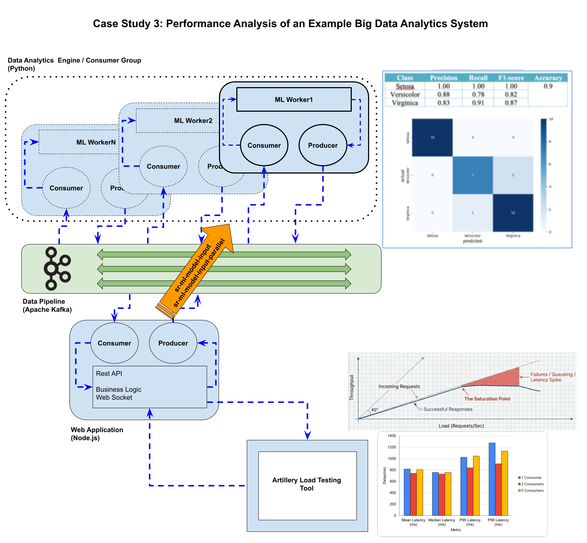

# Case Study 3: Performance Analysis of an Example Big Data Analytics System

In this project, a web application integrating Apache Kafka and a data analytics engine was developed and evaluated in 
terms of performance and accuracy. The application allows users to input sepal length and sepal width values of an Iris
flower through a simple web interface.

On the backend, a Kafka producer transmits these input values to the data analytics engine via Apache Kafka. 
The analytics engine employs a Logistic Regression model to predict the corresponding Iris species. The inferred 
results are then returned to the RESTful backend and subsequently delivered to the frontend using WebSocket 
communication.

The system was further evaluated to assess both its predictive accuracy and overall performance.





## Kafka

### Setting Up KRaft-Based Kafka Messaging System

* Go to https://kafka.apache.org/quickstart/  
* Binary download: 4.1.x (https://kafka.apache.org/community/downloads/)
* Extract Kafka

**For Linux/OSX-based Systems**

```shell

cd /kafka

#Generate a Cluster UUID 
$ KAFKA_CLUSTER_ID="$(bin/kafka-storage.sh random-uuid)"

#Format Log Directories
$ ./bin/kafka-storage.sh format --standalone -t $KAFKA_CLUSTER_ID -c config/server.properties

#Start the Kafka Server
$ ./bin/kafka-server-start.sh config/server.properties
```

**For Windows-based Systems:**

```shell
cd C:\kafka

REM Generate and capture cluster ID
FOR /F %i IN ('bin\windows\kafka-storage.bat random-uuid') DO SET KAFKA_CLUSTER_ID=%i

REM Format storage
bin\windows\kafka-storage.bat format -t %KAFKA_CLUSTER_ID% -c config\kraft\server.properties

REM Start Kafka
bin\windows\kafka-server-start.bat config\kraft\server.properties

```


### Testing Kafka

[Consumers and Producers](./utils)


## Web Application

[Web Application](./app)

## Data analytics engine 

The system includes a Python-based logistic regression model to make predictions on the Iris dataset.

[Train ML Model](./ml/logistic-regression/train-save-evaluate.py)

[Use ML Model For Predictions](./ml/logistic-regression/load-predict.py)
